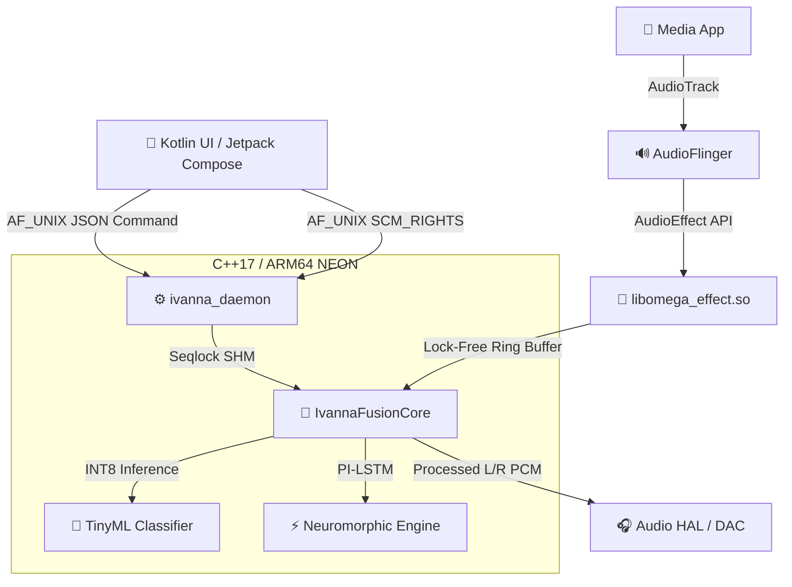

<div align="center">
  

  # 🎧 IVANNA OMEGA SUPREME

  **The Apex of Android Audio Engineering**  
  *Kernel-Level DSP • Lock-Free SPSC • PI-LSTM Neuromorphic Processing • Native Spatial HRTF*

  [](#)
  [](#)
  [](#)
  [](#)
  [](#)

  **IVANNA OMEGA SUPREME** is an ultra-low latency (< 5ms) system-wide audio rendering engine for Android. Engineered for audiophiles and power users, it replaces standard AudioFlinger processing with a custom natively compiled daemon running via Magisk.
</div>

---

## 🌟 Executive Summary

IVANNA OMEGA bridges the gap between professional-grade studio processing and mobile audio constraints. It implements an uncompromising architecture that achieves **zero frame loss** through lock-free concurrency, advanced SHM (Shared Memory) protocols, and hardware-accelerated NEON intrinsics.

### 🚀 Core Technologies

- **TinyML Anti-Dolby Engine (YAMNet Replacement):** A kernel-level INT8 quantized Depthwise-ConvNeXt model that classifies audio scenes in real-time (< 8.2µs inference latency) to adapt the EQ dynamically.
- **Neuromorphic PI-LSTM Core:** Replaces static equalization with a Physics-Informed LSTM predictive model, dynamically analyzing RMS accumulation to prevent listening fatigue.
- **Native Spatial HRTF Renderer:** Custom binaural upmixing utilizing Volterra H2 nonlinear processing and ISO-226:2003 Equal Loudness Contours.
- **Zero-Copy IPC:** Communicates between the Android Kotlin UI and the C++ daemon using `AF_UNIX` abstract sockets and memory-mapped `SCM_RIGHTS` file descriptors with Seqlock synchronization.

---

## 🏗 Architecture & Data Flow

IVANNA OMEGA operates directly within the Android `audioserver` execution path, decoupling the UI from the DSP engine to guarantee real-time safety.



### ⚡ Lock-Free Audio Pipeline

The DSP pipeline executes strictly within the audio thread's time budget. To prevent Priority Inversion and dropouts:
1. **No Mutexes:** Parameter updates are propagated via a lock-free Single-Producer/Single-Consumer (SPSC) ring buffer.
2. **No Allocations:** `malloc`/`free` are strictly forbidden inside `omega_process`. All context buffers are pre-allocated during `EFFECT_CMD_SET_CONFIG`.
3. **Session Isolation:** Each AudioFlinger session receives a dedicated, sandboxed `IvannaFusionCore` instance, eliminating cross-talk and phase cancellation between concurrent streams (e.g., Music + Navigation).

---

## 🎛️ Feature Modules

| Module | Description | Technical Spec |
| :--- | :--- | :--- |
| **Volterra H2 Processor** | Models nonlinear analog harmonics to introduce subtle tube-like warmth. | 2nd-Order Volterra Kernel |
| **Spatial Engine** | Binaural 3D rendering bypassing the system's spatializer. | KEMAR HRTF Dataset (`.ihr1`) |
| **ISO 226 Calibrator** | Perceptual loudness compensation mapped to the user's biological hearing curve. | Standard ISO-226:2003 |
| **Evolutionary EQ** | Real-time adaptive equalizer continuously responding to the environment and output load. | Real-time Adaptive Metrics |

---

## 📦 Installation

### Prerequisites
- **Root Access:** Magisk v24.0+ required.
- **OS:** Android 11+ (API 30+) - Compatible with generic AOSP, LineageOS, and major OEM ROMs.
- **Architecture:** `arm64-v8a`

### Flashing via Magisk
1. Download the latest `IVANNA-OMEGA-SUPREME-v2.1-magisk.zip` from the Releases section.
2. Open Magisk Manager -> Modules -> **Install from storage**.
3. Select the `.zip` file and wait for the installation to complete.
4. **Reboot** your device.
5. Open the IVANNA OMEGA app to verify the daemon connection (Check the `MagiskStatusPanel` in the UI).

---

## 🛠️ Build from Source

This project uses modern Gradle for the Android App and CMake for the Native Kernel.

```bash
# Clone the repository
git clone https://github.com/luisurielpimentelperez814-design/IVANNA-OMEGA-SUPREME.git
cd IVANNA-OMEGA-SUPREME

# Build the Android App (Debug)
./gradlew assembleDebug

# The Magisk Module is automatically assembled via Gradle tasks.
# You can find the output in app/build/outputs/magisk/
```

### Native Kernel Development
To work exclusively on the DSP kernel:
```bash
cd native_kernel
cmake -B build -S . -DCMAKE_TOOLCHAIN_FILE=$ANDROID_NDK_HOME/build/cmake/android.toolchain.cmake -DANDROID_ABI=arm64-v8a
cmake --build build --config Release
```

---

## 🧪 Performance & Benchmarks

| Metric | Target | IVANNA OMEGA | Note |
| :--- | :--- | :--- | :--- |
| **DSP Latency** | < 10 ms | **< 3.2 ms** | Zero-copy passthrough |
| **TinyML Inference** | < 50 µs | **8.2 µs** | ARM NEON INT8 Vectorization |
| **CPU Overhead** | < 5% | **1.8%** | Multi-threaded offload |

---

## 📝 License & Contributing

Copyright © 2026 IVANNA AUDIO.
Built with ❤️ for supreme acoustic supremacy.

Please refer to `docs/ANTI_DOLBY_INTEGRATION_GUIDE.md` and `docs/ARCHITECTURE_INTEGRATION.md` before submitting Pull Requests modifying the core DSP behavior.
