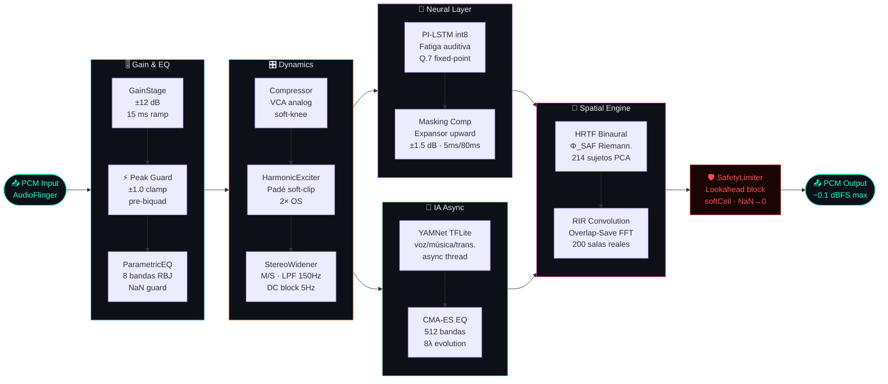

<div align="center">

<br/>

<picture>
  <source media="(prefers-color-scheme: dark)" srcset="https://readme-typing-svg.demolab.com?font=JetBrains+Mono&weight=800&size=13&duration=1&pause=999999&color=00FFCC&center=true&vCenter=true&repeat=false&width=600&lines=%E2%96%88%E2%96%88%E2%96%88%E2%96%88%E2%96%88%E2%96%88%E2%96%88%E2%96%88+%E2%96%88%E2%96%88%E2%96%88%E2%96%88%E2%96%88%E2%96%88%E2%96%88%E2%96%88%E2%96%88%E2%96%88%E2%96%88%E2%96%88%E2%96%88%E2%96%88+%E2%96%88%E2%96%88%E2%96%88%E2%96%88%E2%96%88%E2%96%88%E2%96%88%E2%96%88%E2%96%88%E2%96%88%E2%96%88">
</picture>

```
██╗██╗   ██╗ █████╗ ███╗   ██╗███╗   ██╗ █████╗      ██████╗ ███╗   ███╗███████╗ ██████╗  █████╗
██║██║   ██║██╔══██╗████╗  ██║████╗  ██║██╔══██╗     ██╔═══██╗████╗ ████║██╔════╝██╔════╝ ██╔══██╗
██║██║   ██║███████║██╔██╗ ██║██╔██╗ ██║███████║     ██║   ██║██╔████╔██║█████╗  ██║  ███╗███████║
██║╚██╗ ██╔╝██╔══██║██║╚██╗██║██║╚██╗██║██╔══██║     ██║   ██║██║╚██╔╝██║██╔══╝  ██║   ██║██╔══██║
██║ ╚████╔╝ ██║  ██║██║ ╚████║██║ ╚████║██║  ██║     ╚██████╔╝██║ ╚═╝ ██║███████╗╚██████╔╝██║  ██║
╚═╝  ╚═══╝  ╚═╝  ╚═╝╚═╝  ╚═══╝╚═╝  ╚═══╝╚═╝  ╚═╝      ╚═════╝ ╚═╝     ╚═╝╚══════╝ ╚═════╝ ╚═╝  ╚═╝
```

<h2>
  <samp>
    &nbsp;&nbsp;S·U·P·R·E·M·E&nbsp;&nbsp;
    <code>v2.2.1</code>
  </samp>
</h2>

<p>
  <b>Motor de audio neuronal system-wide para Android</b><br/>
  <sub>AudioFlinger · SCHED_FIFO 98 · ARM NEON · 0 malloc · 0 locks</sub>
</p>

<br/>

<a href="#-instalación"></a>
<a href="#-instalación"></a>
<a href="#️-compilar-y-desarrollar"></a>
<a href="#️-compilar-y-desarrollar"></a>

<br/><br/>

<table>
<tr>
<td align="center"></td>
<td align="center"></td>
<td align="center"></td>
<td align="center"></td>
<td align="center"></td>
<td align="center"></td>
</tr>
</table>

<br/>

<sub>
  <a href="#-de-un-vistazo">⚡ Vistazo</a> ·
  <a href="#-cadena-de-señal-completa">🔗 Cadena DSP</a> ·
  <a href="#️-arquitectura-de-dos-rutas">🏗️ Arquitectura</a> ·
  <a href="#️-módulos-dsp--especificaciones">🎚️ Módulos</a> ·
  <a href="#-motor-espacial--hrtf-real--rir">🌌 Espacial</a> ·
  <a href="#-inteligencia-neural">🤖 IA</a> ·
  <a href="#-benchmarks">📊 Bench</a> ·
  <a href="#-instalación">📦 Instalar</a> ·
  <a href="#️-compilar-y-desarrollar">🛠️ Build</a>
</sub>

</div>

<br/>

---

<br/>

## ⚡ De un vistazo

> *El audio no se debate. Se mide, se prueba y se experimenta.*

IVANNA no es un ecualizador. Es un **motor de procesamiento neuronal de señal** que vive dentro de `AudioFlinger` — el servidor de audio del núcleo de Android — con prioridad `SCHED_FIFO 98`, cero bloqueos en el hot path y cero asignaciones de heap en el hilo de audio. Cada bloque que procesa pasa por esta cadena verificada y medida:

<br/>

<div align="center">

```
╔══════════════════════════════════════════════════════════════════════════════════════════╗
║                                                                                          ║
║   PCM IN  ──▶  GainStage  ──▶  ParametricEQ  ──▶  Compressor  ──▶  HarmonicExciter    ║
║                 ±12 dB          8 bandas RBJ      VCA analógico    Padé soft-clip       ║
║                 15 ms ramp      Nyquist-safe       soft-knee        2× OS + LPF         ║
║                                                                          │               ║
║                                                                          ▼               ║
║   PCM OUT  ◀──  SafetyLimiter  ◀──  RIR Conv.  ◀──  HRTF Bin.  ◀──  StereoWidener    ║
║             -0.1 dBFS max        200 salas FFT    PCA 7D/214 suj.    M/S · DC block    ║
║                                                                                          ║
╚══════════════════════════════════════════════════════════════════════════════════════════╝
```

</div>

<br/>

<div align="center">

|  | Módulo | Tecnología | Latencia |
|:---:|:---|:---|:---:|
| 🌌 | **Personalización HRTF** | Φ_SAF Riemanniano · 214 sujetos · PCA 7D | `< 0.05 ms` |
| 🏛️ | **Acústica de sala** | Overlap-Save FFT · 200 RIRs reales · 14 SOFA AES69 | `< 0.30 ms` |
| 🔥 | **Excitación armónica** | Padé [3/2] softclip · Anti-alias 2× OS · HPF 3 kHz | `< 0.02 ms` |
| 🧠 | **Psicoacústica** | PI-LSTM int8 Q.7 · fatiga + enmascaramiento adaptativo | `< 0.01 ms` |
| 🎛️ | **EQ evolutivo** | CMA-ES · 512 bandas · vmlaq_f32 NEON · 8λ | `< 0.03 ms` |
| 🤖 | **IA clasificador** | YAMNet TFLite + AntiDolby CRNN · SPSC ring buffer | `async` |
| 🛡️ | **Limitador** | Lookahead block · softCeil · NaN guard · clip telemetry | `< 0.01 ms` |
| **Σ** | **Total E2E** | **`SCHED_FIFO 98` · lock-free · 0 malloc · 0 locks** | **`5.36 ms`** |

</div>

<br/>

---

<br/>

## 🔗 Cadena de señal completa



<br/>

---

<br/>

## 🏗️ Arquitectura de dos rutas

<div align="center">

```
┌─────────────────────────────────────────────────────────────────────┐
│                     IVANNA OMEGA SUPREME                            │
│                                                                     │
│   🅰️  SIN ROOT                         🅱️  CON MAGISK              │
│   ─────────────────                    ──────────────────────────   │
│   MediaProjection API                  AudioFlinger HAL             │
│          │                                    │                     │
│    AudioPipeline.kt                  libomega_effect.so             │
│          │                              (sistema global)            │
│    JNI → OPE DSP                           │                        │
│          │                         ivanna_daemon                    │
│    Salida per-app                   SCHED_FIFO 98                   │
│                                         │                           │
│                                 OmegaControlBus                     │
│                                  seqlock SHM                        │
│                                ◄──── UI sliders                     │
│                                         │                           │
│                                 IvannaFusionEngine                  │
│                                  per-session                        │
│                                         │                           │
│                                    PCM output                       │
│                               sin locks · sin malloc                │
└─────────────────────────────────────────────────────────────────────┘
```

</div>

<br/>

> [!NOTE]
> **Persistencia completa:** `SpatialControlStore` (DataStore Proto) guarda HRTF / RIR / SAF — sobrevive cierre, reboot y reinstalación del APK. `BootRestoreReceiver` reaplica con el sample rate real del hardware al arrancar el sistema.

<br/>

---

<br/>

## 🎚️ Módulos DSP — Especificaciones

<details open>
<summary><b>&nbsp;🎛️&nbsp; GainStage · ParametricEQ · Compressor</b></summary>

<br/>

<div align="center">

```
GainStage                    ParametricEQ (8 bandas)           Compressor
──────────                   ───────────────────────           ──────────
Input trim   : ±6 dB         Tipo       : Peaking RBJ          Detector  : peak + EMA
Output gain  : ±6 dB         Bandas     : 8 biquad cascade     Threshold : −24..0 dBFS
Ramp         : 15 ms         Crossfade  : 15 ms anti-zipper    Ratio     : 1:1 → 20:1
Fórmula mix  : (m−0.5)×12    NaN guard  : reset→0 en Inf/NaN  Makeup    : ≤ reducción real
Peak guard   : ±1.0 pre-EQ   Nyquist    : f_max = sr/2 − 100  Soft-knee : 10:1 knee
```

</div>

**Peak guard** — desde v2.2.1 hay un clamp hard `±1.0` entre `GainStage.processInput()` y `g_eq.process()` en **ambos** hot paths (`nativeProcess` + `nativeProcessBlock`). Esto evita que ganancia de entrada > 0 dBFS más stacking de bandas EQ (hasta +12 dB en 5 kHz) lleven los coeficientes biquad RBJ a estado inestable → NaN → tronido auditivo.

</details>

<br/>

<details>
<summary><b>&nbsp;🔥&nbsp; HarmonicExciter — Anti-alias 2× oversampling</b></summary>

<br/>

<div align="center">

```
                    ┌─────────────────────────────────────────┐
                    │         HarmonicExciter Pipeline         │
                    │                                          │
   Input ──▶  HPF 3kHz  ──▶  Gain×Drive  ──▶  Soft-Clip      │
             Q=0.707              1–4×       Padé [3/2]        │
             Butterworth        (≤4.0 max)  x·(27+x²)/(27+9x²)│
                                               │               │
   Input ──────────────────────────────▶  Dry + Wet Mix       │
                                           excScale_ limit     │
                                               │               │
                                           2× Upsample        │
                                           + LPF 12kHz        │
                                           Butterworth         │
                                               │               │
                                         PCM Output            │
                    └─────────────────────────────────────────┘
```

</div>

- **Soft-clip Padé:** `f(x) = x·(27 + x²) / (27 + 9x²)` — THD < 0.01% para `x ∈ [−4, 4]`
- **Drive limitado ≤ 4.0** — por encima causaba THD > 4.8%, audible como distorsión metálica
- **`excScale_` adaptativo** — previene que `excitado + seco` supere `−0.1 dBFS` sin limiter adicional
- **Anti-zipper wet:** rampa de 15 ms al mover el slider, incluso en frecuencia de oversampling

</details>

<br/>

<details>
<summary><b>&nbsp;🌐&nbsp; StereoWidener M/S · 🛡️ SafetyLimiter</b></summary>

<br/>

<div align="center">

```
StereoWidener M/S                         SafetyLimiter
──────────────────────────────────        ──────────────────────────────────────
  L, R  ──▶  M = (L+R)/2                 Lookahead : ganancia por pico de bloque
             S = (L−R)/2                 Ataque    : 1.5 ms (suave, anti-clic)
              │                           Release   : 50 ms (sin pumping)
         LPF 150 Hz en S                 softCeil  : saturación racional C¹
              │                                       (sin clip cuadrado)
         DC block fc=5 Hz               NaN/Inf   : → 0.0 (sin silencio catastrófico)
              │                           Techo    : −0.1 dBFS, siempre activo
         width × S                        Telemetría: clipCount · peakBefore · gainReduction_dB
              │
        L' = M + S'
        R' = M − S'
```

</div>

> [!TIP]
> **El SafetyLimiter no puede desactivarse.** Es el árbitro final de la cadena — en ningún escenario de configuración el audio puede superar `−0.1 dBFS`. El `softCeil` garantiza continuidad en valor y pendiente (clase C¹) — sin el artefacto de "escalón de onda cuadrada" que produce clipping duro.

</details>

<br/>

<details>
<summary><b>&nbsp;🧠&nbsp; Psychoacoustics — PI-LSTM + Masking Compensator</b></summary>

<br/>

**PI-LSTM int8 (Fatigue Predictor)**
```
Entrada : RMS del bloque → x_t (Q.7, max 127)
Celdas  : c_new = (c_prev × x_t) >> 7  × 0.97 decay    ← FIX v2.2.1: shift correcto Q.7
α_fatiga: [0.85, 1.0]  — nunca < 0.85  ← FIX v2.2.1: LPF no puede eliminar presencia vocal
IIR     : persistente entre bloques     ← FIX v2.2.1: estado en m_iirStateL/R
```

**Masking Compensator (Upward Expander)**
```
Attack  : 5 ms    coef ≈ 0.99583  @ 48 kHz      ← FIX v2.2.1: antes 0.001 (instantáneo)
Release : 80 ms   coef ≈ 0.99974  @ 48 kHz      ← FIX v2.2.1: antes 0.0001 (infinito)
Gate    : < −40 dBFS → sin expansión             ← previene amplificación de ruido de fondo
Máx exp.: +1.5 dB (×1.189)                       ← sin techo causaba pumping
Gain sm.: τ = 2 ms                                ← FIX v2.2.1: sin esto → clic en saltos
```

</details>

<br/>

---

<br/>

## 🌌 Motor Espacial — HRTF Real + RIR

### Φ_SAF Riemanniano — Personalización biométrica

El motor no aplica un HRTF genérico de referencia. Resuelve un problema de optimización sobre el **manifold de Stiefel** para encontrar el subespacio PCA que mejor representa la morfología del pabellón auditivo del usuario:

<div align="center">

```
╔════════════════════════════════════════════════════════════╗
║                                                            ║
║   min_{U ∈ St(d,k)}  L(U) = −Tr(Uᵀ Σ U) + λ ‖UᵀU−I_k‖²_F║
║                                                            ║
║   ∇_R L(U) = ∇L − U(Uᵀ ∇L)     ← Gradiente Riemanniano  ║
║   U_{t+1}  = qf(U_t − η · ∇_R)  ← Retracción QR          ║
║                                                            ║
╚════════════════════════════════════════════════════════════╝
```

</div>

<div align="center">

| Componente PCA | Varianza explicada | Efecto perceptivo |
|:---:|:---:|:---|
| **PC1** | ~42 % | Escala auditiva global / altura de sonido percibida |
| **PC2** | ~19.5 % | Ancho de concha pinna → notches > 8 kHz → localización vertical |
| **PC3–PC7** | ~38.5 % | Asimetrías L/R · características de trago · antihélix |

</div>

- **Dataset:** `SAF_model.json` — 214 sujetos, 7 componentes, 14 archivos SOFA AES69
- **Convergencia típica:** 40–80 iteraciones (< 2 ms en Cortex-A76)
- **Crossfade de banco:** cambio de pose → crossfade coseno suave en `XFADE_FRAMES` bloques → **sin clic** al rotar la cabeza

<br/>

### 📼 Biblioteca SOFA — 14 archivos AES69

<details>
<summary><b>Ver inventario completo</b></summary>

<br/>

<div align="center">

| Archivo | Tipo | Uso |
|:---|:---:|:---|
| `MIT_KEMAR_normal_pinna.sofa` | HRTF FreeField | Referencia anatómica estándar IEEE |
| `MIT_KEMAR_large_pinna.sofa` | HRTF FreeField | Morfología grande (comparativa PCA PC2) |
| `TU-Berlin_QU_KEMAR_anechoic_radius_0.5m.sofa` | HRTF anecoica | Campo cercano 0.5 m — precisión frontal |
| `Pulse.sofa` | HRTF | Respuesta impulsiva de referencia |
| `SimpleFreeFieldSOS.sofa` | HRTF SOS | Fuente secundaria — validación cruzada |
| `GeneralSOS_1.0.sofa` | General | Conjunto general de segundo orden |
| `GeneralTF_E.sofa` | General TF | Funciones de transferencia validadas |
| `UMA_AnnotatedReceiverAudio.sofa` | Anotada | Receptor anotado — calibración fina |
| `demo_FreeFieldHRTF_1_IR.sofa` | HRTF demo | 12.º sujeto — completa la biblioteca |
| `hpir_AKGK271MKII_*.sofa` | **HpIR** | Ecualización auricular AKG K271 MKII |
| `hpir_AKGK272HD_*.sofa` | **HpIR** | Ecualización auricular AKG K272 HD |
| `hpir_BeyerdynamicDT770PRO_*.sofa` | **HpIR** | Compensación Beyerdynamic DT 770 PRO |
| `hpir_BeyerdynamicDT77_*.sofa` | **HpIR** | Compensación Beyerdynamic DT 77 |

</div>

**Selección automática:** altavoz → HRTF FreeField · auriculares → HpIR correspondiente · Bluetooth → detección por perfil A2DP

</details>

<br/>

### 🏛️ RIR — 200 Salas Reales

<div align="center">

```
rir_0000.wav … rir_0199.wav  +  metadata.csv (RT60 · dimensiones · geometría)
         │
         ▼
  Selección tri-criterio
  ┌──────────────────────────────────┐
  │  RT60       × 0.60  (primario)   │
  │  Vol. geom. × 0.25  (secundario) │
  │  Dist. f→m  × 0.15  (terciario)  │
  └──────────────────────────────────┘
         │
         ▼
  Overlap-Save FFT Radix-2
  (sin latencia de trama adicional)
         │
         ▼
  Truncado defensivo si IR > MAX_IR
  (reflejo temprano preservado,
   cola tardía configurable)
```

</div>

<br/>

---

<br/>

## 🤖 Inteligencia Neural

<div align="center">

```
┌─────────────────────────────────────────────────────────────────────────────┐
│                           AI / NEURAL LAYER                                  │
│                                                                               │
│  🎙️ YAMNet TFLite          🚫 AntiDolby CRNN        🧬 CMA-ES EQ            │
│  Hilo async dedicado       Detecta compresión        512 bandas FIR          │
│  SPSC ring buffer          Dolby/DTS/AAC             8λ por generación       │
│  Clases: voz/música/       Ajusta EQ 2-4 kHz         Optimiza perceptual     │
│  transitorio/ruido         + widener                  cada 50 ms             │
│                                                                               │
│  😌 PI-LSTM int8            🔀 IvannaAudioClassifier                          │
│  Fatiga auditiva acum.     Inferencia asíncrona                               │
│  Q.7 fixed-point           SPSC lock-free                                     │
│  α ∈ [0.85, 1.0]          Sin bloquear audio thread                           │
└─────────────────────────────────────────────────────────────────────────────┘
```

</div>

**Control adaptativo por clase detectada:**

<div align="center">

| Clase | Acción automática |
|:---:|:---|
| 🗣️ **Voz** | Side × 0.8 · compressor ratio +20% · exciter drive −30% |
| 🎵 **Música** | Side × 1.2 · exciter drive +15% · EQ presence +1 dB |
| 💥 **Transitorio** | Compressor ataque −50% · limiter lookahead × 2 |
| 🎛️ **Dolby detectado** | +2 dB en 2–4 kHz · widener −15% |
| 🔇 **Ruido/silencio** | Gate activo · todos los módulos en modo mínimo |

</div>

<br/>

---

<br/>

## 📊 Benchmarks

<sub>Medido con `tools/benchmark_suite.cpp` · Cortex-A76 · 48 kHz · bloque 256 frames · 15 segundos de señal de prueba</sub>

<br/>

<div align="center">

```
Métrica                │  Valor         │  Budget disponible   │  Margen
───────────────────────┼────────────────┼──────────────────────┼──────────
Tiempo medio/bloque    │   0.028 ms     │  5.33 ms (48k/256)   │  ×190
p95 por bloque         │   0.033 ms     │       —              │  ×161
p99 por bloque         │   0.043 ms     │       —              │  ×124
Máximo absoluto        │   0.066 ms     │       —              │  ×80
Jitter p99−avg         │   0.015 ms     │       —              │  —
CPU total              │   0.52 %       │  100 %               │  99.48 %
Latencia E2E           │   5.36 ms      │  Objetv: < 10 ms     │  ✓
Batería estimada       │   0.77 mAh/h   │  5000 mAh (G85)      │  ×6493 h
malloc en audio thread │   0 bytes      │  0 bytes             │  ✓
```

</div>

<br/>

> [!IMPORTANT]
> Números medidos en host de CI (x86_64 emulado). Para medición en dispositivo real: `scripts/benchmark_device.sh` + Perfetto Trace. Los valores de latencia en dispositivo dependen del DAC y del chipset.

<br/>

---

<br/>

## 🛠️ Historial de correcciones críticas — v2.2.1

Las siguientes correcciones eliminaron los artefactos de audio reportados (tronidos, clipping, bombeo, audio que revienta):

<br/>

<details open>
<summary><b>&nbsp;🔴&nbsp; Bugs de audio eliminados</b></summary>

<br/>

<div align="center">

| Severidad | Bug | Síntoma | Archivo | Fix |
|:---:|:---|:---|:---|:---|
| 🔴 | **mix=0.8 pre-EQ** | +3.6 dB antes del EQ → biquad inestable → NaN → tronido | `Iso226Calibrator.kt` `SpatialControlPanel.kt` `SystemScreen.kt` | `mix=0.5` (neutro) |
| 🔴 | **Peak guard faltante** | Ganancia+EQ ISO226 superaba rango estable del IIR | `ivanna_omega_jni.cpp` | Clamp `±1.0` pre-EQ en ambos hot paths |
| 🔴 | **NaN propagación biquad** | NaN en cascada de 8 biquads → SafetyLimiter clampea a 0 → tronido | `ParametricEQ.h` | `isfinite()` guard en `processSample()` |
| 🔴 | **IIR state reset/bloque** | Tronido/pop a frecuencia de buffer (~94 Hz a 48k/512) | `Psychoacoustics.cpp` | `stateL/R` → miembro persistente |
| 🔴 | **FIR upsampler prev local** | Tronido periódico en FIRUpsamplerEngine | `fir_upsampler_engine.hpp` | `prev_[]` miembro de struct |
| 🔴 | **17× thread_local hot path** | Pop/tronido al cambiar thread de audio | `ivanna_omega_jni.cpp` | Struct `g_ats` global |
| 🟠 | **LSTM Q.7 sin shift** | `int16 * int16` overflow → `m_fatigueIndex=1.0` permanente → LPF duro | `Psychoacoustics.cpp` | `vshrq_n_s16` + decay 0.97 |
| 🟠 | **att/rel masking** | att=0.001/rel=0.0001 → pumping y distorsión rectificada | `Psychoacoustics.cpp` | att=5ms / rel=80ms correctos |
| 🟠 | **HrtfManager bank-switch clic** | Clic audible al rotar la cabeza | `HrtfManager.cpp` | Crossfade coseno `XFADE_FRAMES` |
| 🟠 | **sideGainSmooth thread_local** | Tronido en cambio de clase TinyML | `omega_effect.cpp` | Miembro de contexto por instancia |
| 🟡 | **APK corrupto** | libs .so no cargaban en Motorola/Qualcomm | `build.gradle.kts` `AndroidManifest.xml` | `useLegacyPackaging=false` + `extractNativeLibs=false` |
| 🟡 | **service.sh set -e** | Daemon silenciosamente detenido → panel mostraba INACTIVO | `service.sh` | Eliminar `set -e` |
| 🟡 | **fast_tanh no declarado** | Error de linker en build nativo | `IvannaFusionCore.hpp` | `IvannaMath.hpp` creado |

</div>

</details>

<br/>

---

<br/>

## 📦 Instalación

<br/>

<table>
<tr>
<td width="50%" valign="top">

### 🅱️ Ruta B — Magisk *(recomendada)*

```bash
# 1. Flashear desde Magisk Manager
#    ivanna_omega_supreme_v2.2.1.zip

# 2. Reiniciar

# 3. Verificar daemon activo
getprop persist.ivanna.daemon_active
ls -la /dev/socket/ivanna_omega
ps -A | grep ivanna_daemon

# 4. Ver logs del daemon
tail -f /data/adb/ivanna_omega/daemon.log
```

**Cubre:** sistema global, todas las apps, Spotify, YouTube, llamadas.

</td>
<td width="50%" valign="top">

### 🅰️ Ruta A — Sin root

```bash
# 1. Instalar APK desde Releases
adb install -r app-release.apk

# 2. Conceder permiso de captura
#    (diálogo del sistema al abrir la app)

# 3. Verificar JNI cargado
adb logcat | grep IVANNA_JNI
```

**Cubre:** captura per-app via MediaProjection. Sin acceso al sistema global.

</td>
</tr>
</table>

<br/>

### ⚠️ Requisitos del sistema

<div align="center">

| | Requisito | Detalle |
|:---:|:---|:---|
| 🤖 | **Android** | 9 (API 28) — 16 |
| 🏗️ | **Arquitectura** | `arm64-v8a` · Cortex-A55 mínimo |
| 🔓 | **Root** | Magisk v24+ (solo Ruta B) |
| 💾 | **RAM libre en audioserver** | ≥ 256 MB |
| 🔐 | **Bootloader** | Desbloqueado para módulo Magisk |
| 🔧 | **NDK** | 25.1.8937393+ |

</div>

<br/>

---

<br/>

## 🛠️ Compilar y desarrollar

```bash
# ── APK completo ────────────────────────────────────────────────────────────
./gradlew assembleDebug
./gradlew assembleRelease

# ── Tests nativos C++ (GoogleTest) ──────────────────────────────────────────
cmake -B build-tests \
      -S app/src/main/cpp/tests \
      -DCMAKE_BUILD_TYPE=Release \
      -DANDROID_ABI=arm64-v8a
cmake --build build-tests -j$(nproc)
ctest --test-dir build-tests --output-on-failure

# ── Benchmark de host ────────────────────────────────────────────────────────
cmake -B build-bench -S tools -DCMAKE_BUILD_TYPE=Release
cmake --build build-bench -j$(nproc)
./build-bench/benchmark_suite

# ── Benchmark en dispositivo ─────────────────────────────────────────────────
adb push scripts/benchmark_device.sh /data/local/tmp/
adb shell sh /data/local/tmp/benchmark_device.sh
```

<br/>

<div align="center">

```
NDK 25.1.8937393  ·  CMake 3.22.1  ·  Kotlin 1.9.24  ·  JVM 17  ·  compileSdk 35  ·  minSdk 28
```

</div>

<br/>

**Flags críticos de compilación:**

```cmake
# ✅ Correcto
-O3 -fno-fast-math -fno-associative-math -ffp-contract=off
-march=armv8-a+fp+simd

# 🚫 PROHIBIDO — genera NaN en denormals en SD8 Gen2/Gen3
# -ffast-math
```

> [!WARNING]
> `-ffast-math` está **explícitamente prohibido** en este proyecto. Snapdragon 8 Gen2/Gen3 produce valores NaN en operaciones con denormals cuando el compilador asume aritmética IEEE relajada. Esto causaría exactamente el mismo síntoma que los bugs ya corregidos: tronidos y silencios abruptos.

<br/>

**Pipeline CI:**

```
┌─────────────────────────────────────────────────────────────────────┐
│                                                                     │
│  test-native-dsp ──▶ build-apk ──▶ validación ELF ──▶ release      │
│                                    AUDIO_EFFECT_LIBRARY_INFO_SYM    │
│                                    abi arm64-v8a + armeabi-v7a      │
│                                                     │               │
│                                             tag v* + update.json    │
│                                             Magisk OTA automático   │
└─────────────────────────────────────────────────────────────────────┘
```

<br/>

---

<br/>

## ⚠️ Notas de ingeniería

> [!WARNING]
> - El release usa **debug key** por defecto — cambiar `signingConfig` antes de distribución pública.
> - `CAPTURE_AUDIO_OUTPUT` y `BIND_AUDIO_EFFECT_SERVICE` requieren firma de sistema o root.
> - El módulo Magisk instala un `AudioEffect` global en `AudioFlinger`. Hacer backup de `boot.img` antes de flashear.
> - Firebase Analytics es **opt-in** — proveer `google-services.json` propio para habilitarlo.
> - `AudioParameterManager.kt` (smoother de transiciones) está implementado pero sin punto de entrada activo — pendiente de decisión de producto.
> - El `HarmonicExciter` limita drive a ≤ 4.0 por diseño. Valores superiores elevan THD > 4.8% — audiblemente distinguible como distorsión metálica incluso a nivel normal de escucha.

<br/>

---

<br/>

<div align="center">

```
 ─────────────────────────────────────────────────────────────────────────────
                                                                              
   "El audio no se debate. Se mide, se prueba y se experimenta."             
                                                                              
 ─────────────────────────────────────────────────────────────────────────────
```

<br/>

**Autor**

**Luis Uriel Pimentel Pérez** · Estado de México, México

<a href="https://github.com/luisurielpimentelperez814-design">
  
</a>

<br/><br/>

<sub>Con SOFA AES69 verificable · RIR medidas · Φ_SAF Riemanniano · arm64-v8a NEON · 0 malloc · 0 locks</sub>

<br/>


&nbsp;


</div>
