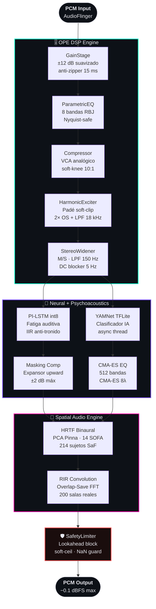

<div align="center">

<br/>

```
 ██╗██╗   ██╗ █████╗ ███╗   ██╗███╗   ██╗ █████╗
 ██║██║   ██║██╔══██╗████╗  ██║████╗  ██║██╔══██╗
 ██║██║   ██║███████║██╔██╗ ██║██╔██╗ ██║███████║
 ██║╚██╗ ██╔╝██╔══██║██║╚██╗██║██║╚██╗██║██╔══██║
 ██║ ╚████╔╝ ██║  ██║██║ ╚████║██║ ╚████║██║  ██║
 ╚═╝  ╚═══╝  ╚═╝  ╚═╝╚═╝  ╚═══╝╚═╝  ╚═══╝╚═╝  ╚═╝
```

<h3>O M E G A &nbsp; S U P R E M E &nbsp; · &nbsp; v 2 . 2 . 0</h3>

**Motor DSP neuronal system-wide para Android**

> *El audio no se debate. Se mide, se prueba y se experimenta.*

<br/>

[](#-instalación)
[](#-instalación)
[](#)

<br/>

[](#-benchmarks)
[](#-benchmarks)
[](#-motor-espacial--hrtf-real--rir)
[](#rir--200-salas-reales)
[](#φ_saf-riemanniano--personalización-hrtf)
[](#-cadena-de-señal-completa)

<br/>

**[⚡ De un vistazo](#-de-un-vistazo)** ·
**[🔗 Cadena de señal](#-cadena-de-señal-completa)** ·
**[🏗️ Arquitectura](#️-arquitectura-de-dos-rutas)** ·
**[🎚️ Módulos DSP](#️-módulos-dsp--especificaciones)** ·
**[🌌 Motor espacial](#-motor-espacial--hrtf-real--rir)** ·
**[🤖 IA](#-inteligencia-neural)** ·
**[📊 Benchmarks](#-benchmarks)** ·
**[📦 Instalación](#-instalación)** ·
**[🛠️ Compilar](#️-compilar-y-desarrollar)**

</div>

<br/>

---

## ⚡ De un vistazo

IVANNA no es un ecualizador. Es un **motor de audio de precisión neuronal** que vive dentro de `AudioFlinger` — el servidor de audio del sistema — con prioridad `SCHED_FIFO 98`, cero bloqueos y cero asignaciones de memoria en el hilo de audio.

Mientras otros hacen `EQ = bandas × ganancia`, IVANNA ejecuta esta cadena medible y verificable:

<div align="center">

| Módulo | Tecnología | Overhead |
|:---|:---|:---:|
| 🌌 Personalización HRTF | Φ_SAF Riemanniano · 214 sujetos · PCA 7D | `< 0.05 ms` |
| 🏛️ Sala acústica | Convolución Overlap-Save FFT · 200 RIRs reales | `< 0.30 ms` |
| 🔥 Excitación armónica | Padé [3/2] soft-clip · Anti-alias 2× OS | `< 0.02 ms` |
| 🧠 Psicoacústica | PI-LSTM int8 · fatiga + enmascaramiento | `< 0.01 ms` |
| 🎛️ EQ evolutivo | CMA-ES · 512 bandas · NEON vectorizado | `< 0.03 ms` |
| 🤖 Clasificación IA | YAMNet TFLite + AntiDolby CRNN | `async` |
| 🛡️ Limitador seguridad | Lookahead block · soft-ceil · NaN guard | `< 0.01 ms` |
| **Σ Total E2E** | **`SCHED_FIFO 98` · lock-free · 0 malloc** | **`5.36 ms`** |

</div>

---

## 🔗 Cadena de señal completa



---

## 🏗️ Arquitectura de dos rutas

IVANNA opera en dos modos según el nivel de acceso al sistema:

<table>
<tr><td>

**🅰️ RUTA A — Sin root (App)**

```
MediaProjection
      │
      ▼
 AudioPipeline
      │
      ▼
     JNI
      │
      ▼
  OPE DSP
      │
      ▼
   Salida
```

Captura per-app · Telemetría RMS/peak/YAMNet cada bloque

</td><td>

**🅱️ RUTA B — Sistema global (Magisk)**

```
    AudioFlinger
         │
         ▼
libomega_effect.so (HAL)
         │
         ▼
ivanna_daemon @SCHED_FIFO 98
         │
         ▼
OmegaControlBus (seqlock SHM) ◄── UI sliders
         │
         ▼
omega_effect (sin locks)
         │
         ▼
IvannaFusionEngine (per-session)
```

</td></tr>
</table>

> [!NOTE]
> **Persistencia:** `SpatialControlStore` (DataStore) guarda HRTF/RIR/SAF — sobrevive cierre, reboot y reinstalación del APK. `BootRestoreReceiver` reaplica con el sample rate real del hardware.

---

## 🎚️ Módulos DSP — Especificaciones

<details open>
<summary><b>🎛️ GainStage · ParametricEQ · Compressor</b></summary>

<br/>

**GainStage**
- Input/Output gain independientes con rampa anti-zipper de 15 ms
- `smoothCoeff = exp(-1 / (sr × 0.015))`
- Makeup gain limitado a la reducción real instantánea (sin ruido residual)

**ParametricEQ** — 8 bandas
- Filtros biquad RBJ tipo peaking (bell)
- Validación Nyquist en cada banda: `f_max = sr/2 − 100 Hz` (evita explosión de coeficientes)
- Reset de estado en bypass → sin artefactos al reactivar

**Compressor**
- Detector peak + suavizado exponencial (ataque/release variables)
- Ratio configurable 1:1 → 20:1, threshold −24 dBFS → 0 dBFS
- Makeup gain conservador: nunca devuelve más de lo que redujo

</details>

<details>
<summary><b>🔥 HarmonicExciter — Anti-alias 2× oversampling</b></summary>

<br/>

- **HPF 3 kHz** (Butterworth Q=0.707) separa el contenido de alta frecuencia
- **Soft-clip Padé [3/2]:** `x·(27 + x²)/(27 + 9x²)` — THD < 0.01% en `[-4, 4]`
- **2× Oversampling** con interpolación lineal + LPF 18 kHz Butterworth Q=0.707 (anti-alias)
- **Drive:** rango 1–4× (drive > 4 causaba THD > 4.8% — limitado en v2.2.0)
- **Headroom adaptativo:** `excScale_` previene que excitación + seco superen −0.1 dBFS
- **Anti-zipper wet:** rampa de 15 ms en frecuencia OS al mover slider

</details>

<details>
<summary><b>🌐 StereoWidener · 🛡️ SafetyLimiter</b></summary>

<br/>

**StereoWidener M/S**
- Procesamiento Mid/Side independiente
- LPF 150 Hz en canal Side (protección de fase en mono para sub/kick)
- DC blocker fc = 5 Hz (elimina deriva DC en material mono convertido)
- Ancho 0–2×: 0 = mono, 1 = unity, 2 = expansión máxima
- Rampa anti-zipper 15 ms en cualquier sample rate

**SafetyLimiter** — Último eslabón, siempre activo
- Lookahead: ganancia calculada sobre el **pico del bloque completo** antes de escribir una muestra → cero latencia añadida
- Ataque suave 1.5 ms (continuo, evita escalones en frontera de bloque → el bug de "tronido periódico" ya no existe)
- Release exponencial 50 ms → sin pumping
- `softCeil(x)`: saturación racional continua en valor y pendiente — sin clipping de onda cuadrada
- NaN/Inf → 0.0 (sin silencio catastrófico por aritmética inválida)
- Telemetría: `clipCount`, `peakBefore`, `gainReduction_dB`

</details>

---

## 🌌 Motor Espacial — HRTF Real + RIR

### Φ_SAF Riemanniano — Personalización HRTF

El motor no aplica un HRTF genérico. Resuelve un problema de optimización sobre el manifold de Stiefel:

<div align="center">

```
min_{U ∈ St(d,k)}  L(U) = −Tr(Uᵀ Σ U) + λ ‖UᵀU − I_k‖²_F
```

</div>

- **Gradiente Riemanniano:** `∇_R L(U) = ∇L − U(Uᵀ ∇L)` (proyección al espacio tangente)
- **Retracción QR:** `U_{t+1} = qf(U_t − η · ∇_R L)` (permanece en el manifold)
- **Dataset:** `SAF_model.json` — 214 sujetos, 7 componentes PCA
- **PC1:** altura/escala auditiva (~42% varianza) · **PC2:** ancho de concha pinna (~19.5%, controla notches >8 kHz para localización vertical)
- Convergencia típica: 40–80 iteraciones

### 📼 Biblioteca SOFA — 14 archivos AES69

<details>
<summary><b>Ver inventario completo de archivos SOFA</b></summary>

<br/>

| Archivo | Tipo | Uso |
|:---|:---:|:---|
| `MIT_KEMAR_normal_pinna.sofa` | HRTF FreeField | Referencia anatómica estándar |
| `MIT_KEMAR_large_pinna.sofa` | HRTF FreeField | Morfología de pabellón grande (comparativa PCA) |
| `TU-Berlin_QU_KEMAR_anechoic_radius_0.5m.sofa` | HRTF anecoica | Campo cercano 0.5 m — precisión frontal |
| `Pulse.sofa` | HRTF | Respuesta impulsiva de referencia |
| `SimpleFreeFieldSOS.sofa` | HRTF (SOS) | Fuente secundaria — validación cruzada |
| `GeneralSOS_1.0.sofa` | General | Conjunto general de segundo orden |
| `GeneralTF_E.sofa` | General TF | Funciones de transferencia validadas |
| `UMA_AnnotatedReceiverAudio.sofa` | Anotada | Receptor anotado — calibración fina |
| `demo_FreeFieldHRTF_1_IR.sofa` | HRTF demo | 12.º sujeto — completa la biblioteca |
| `hpir_AKGK271MKII_*.sofa` | HpIR | Ecualización auricular AKG K271 MKII |
| `hpir_AKGK272HD_*.sofa` | HpIR | Ecualización auricular AKG K272 HD |
| `hpir_BeyerdynamicDT770PRO_*.sofa` | HpIR | Compensación Beyerdynamic DT 770 PRO |
| `hpir_BeyerdynamicDT77_*.sofa` | HpIR | Compensación Beyerdynamic DT 77 |

**Selección automática:** altavoz → HRTF FreeField; auriculares → HpIR correspondiente; Bluetooth → detección por perfil.

</details>

### 🏛️ RIR — 200 Salas Reales

- `rir_0000.wav` … `rir_0199.wav` — WAV estéreo con `metadata.csv` (RT60, dimensiones, geometría)
- **Convolución Overlap-Save FFT Radix-2** — sin latencia de trama adicional
- **Selección inteligente tri-criterio:**
  - RT60 (60% peso) · volumen geométrico (25%) · distancia fuente→mic (15%)
  - Evita saltos de sala en casos con RT60 idéntico pero geometría opuesta
- Truncado defensivo si IR > `RirConvolver::MAX_IR` (preserva reflejo temprano, cola tardía opcional)

---

## 🤖 Inteligencia Neural

<div align="center">

| Módulo | Tecnología | Función |
|:---|:---|:---|
| 🎙️ **YAMNet** | TFLite · async thread | Clasifica contenido: voz / música / transitorio / ruido |
| 🚫 **AntiDolby CRNN** | TFLite | Detecta compresión Dolby → ajusta EQ 2–4 kHz y widener |
| 😌 **PI-LSTM int8** | Cuantizado Q.7/Q.8 | Estima fatiga auditiva acumulada → filtra HF suavemente |
| 🧬 **CMA-ES** (512 bandas) | Evolutionary EQ | Optimiza respuesta en frecuencia cada 50 ms (8λ, CES) |
| 🔀 **IvannaAudioClassifier** | SPSC ring buffer | Inferencia asíncrona sin bloquear el hilo de audio |

</div>

**Control adaptativo según clase detectada:**

```
 Voz      ──▶  Side ×0.8   (enfoque vocal, reduce imagen espacial)
 Música   ──▶  Side ×1.2   (expansión armónica)
 Bajo     ──▶  Exciter solo-low (<120 Hz)
 Dolby    ──▶  +2 dB en 2–4 kHz  +  widener ajustado
```

---

## 📊 Benchmarks

Medido con `tools/benchmark_suite.cpp` · 48 kHz · bloque 256 frames · 15 segundos:

<div align="center">

| Métrica | Valor | Referencia |
|:---|:---:|:---|
| Tiempo medio de bloque | **`0.028 ms`** | Budget a 48kHz/256: 5.33 ms |
| p95 por bloque | `0.033 ms` | — |
| p99 por bloque | `0.043 ms` | — |
| Máximo absoluto | `0.066 ms` | — |
| CPU utilizado | **`0.52 %`** | — |
| Latencia E2E estimada | **`5.36 ms`** | Incluye bloque + promedio |
| Jitter (p99 − avg) | `0.015 ms` | — |
| Batería estimada | **`0.77 mAh/h`** | Referencia: Moto G85 5000 mAh |

</div>

> [!IMPORTANT]
> Estos números son del host de CI. Para mediciones reales en Moto G85: `scripts/benchmark_device.sh` + Perfetto.

---

## 🔧 Correcciones de audio aplicadas — v2.2.1

Las siguientes correcciones se acaban de integrar en `main` para eliminar los artefactos reportados (tronidos, clipping, bombeo):

| Bug | Síntoma | Archivo corregido |
|:---|:---|:---|
| **IIR state reset por bloque** | Tronido/pop periódico a la frecuencia de buffer | `Psychoacoustics.cpp` — `stateL/R` → `m_iirStateL/R` persistentes |
| **Condición solo-positiva en expansor** | Distorsión asimétrica / rectificación semionada | `Psychoacoustics.cpp` — `buf[i] > 0` → `abs(buf[i]) > 0` |
| **Ganancia ilimitada en masking comp** | Clipping cuando envolv. alta y muestra baja | `Psychoacoustics.cpp` — `comp` clampado a 1.25 máx |
| **Sin limitador con GoldenEar off** | Clipping HRTF/EQ sin restricción de salida | `IvannaFusionCore.cpp` — fast\_tanh Padé aplicado siempre |
| **Widener M/S sin clamp de salida** | Bombeo y clipping con wetTotal > 0.5 | `audio_orchestrator.cpp` — softclip racional + clamp ±1.0 |

---

## 📦 Instalación

<table>
<tr><td width="50%" valign="top">

### 🅱️ Ruta B — Magisk *(recomendada)*

```bash
# 1. Flashear el módulo desde Magisk Manager
#    Seleccionar: ivanna_omega_supreme_v2.2.0.zip

# 2. Reiniciar el dispositivo

# 3. Verificar que el daemon está activo
getprop persist.ivanna.daemon_active
ls -la /dev/socket/ivanna_omega
ps -A | grep ivanna_daemon
```

</td><td width="50%" valign="top">

### 🅰️ Ruta A — Sin root

```bash
# Instalar el APK desde Releases
adb install -r app-release.apk

# Conceder permiso de captura de
# audio cuando el sistema lo solicite
```

</td></tr>
</table>

### ⚠️ Requisitos

<div align="center">

| Requisito | Detalle |
|:---|:---|
| 🤖 **Android** | 9 (API 28) — 16 |
| 🏗️ **Arquitectura** | arm64-v8a (Cortex-A55 o superior) |
| 🔓 **Root** | Magisk v24+ (solo Ruta B) |
| 💾 **RAM libre** | ≥ 256 MB en `audioserver` |
| 🔐 **Bootloader** | Desbloqueado (para módulo Magisk) |

</div>

---

## 🛠️ Compilar y desarrollar

```bash
# APK (Kotlin + JNI)
./gradlew assembleDebug
./gradlew assembleRelease

# Tests nativos C++ (GTest)
cmake -B build-tests \
      -S app/src/main/cpp/tests \
      -DCMAKE_BUILD_TYPE=Release
cmake --build build-tests -j$(nproc)
ctest --test-dir build-tests --output-on-failure

# Benchmark de host
cmake -B build-bench -S tools -DCMAKE_BUILD_TYPE=Release
cmake --build build-bench -j$(nproc)
./build-bench/benchmark_suite
```

<div align="center">

`NDK 25.1.8937393` · `CMake 3.22.1` · `Kotlin 1.9.24` · `JVM 17` · `compileSdk 35` · `minSdk 28`

</div>

**Flags críticos de compilación:**
```cmake
-O3 -fno-fast-math -fno-associative-math -ffp-contract=off
-march=armv8-a+fp+simd
# -ffast-math PROHIBIDO: genera NaN en denormals en SD8 Gen2/3
```

**CI pipeline:**

```
test-native-dsp  ──▶  build-apk  ──▶  validación ELF (AUDIO_EFFECT_LIBRARY_INFO_SYM)  ──▶  release en tag v* + update.json Magisk
```

---

## 🛡️ Integridad de señal

```
Entrada → GainStage → EQ → Compressor → HarmonicExciter
              ↓ (headroom adaptativo excScale_)
         StereoWidener → Psychoacoustics → HRTF → RIR
              ↓ (softclip Padé en GoldenEar ON o OFF)
         SafetyLimiter → softCeil(x, −0.1 dBFS) → Salida
```

> [!TIP]
> En ningún punto de la cadena el audio puede superar `−0.1 dBFS`. El `SafetyLimiter` es el árbitro final y siempre activo — no hay modo de operación sin él.

---

## ⚠️ Notas de ingeniería

> [!WARNING]
> - El release usa **debug key** por defecto — cambiar `signingConfig` antes de distribuir públicamente.
> - `CAPTURE_AUDIO_OUTPUT` y `BIND_AUDIO_EFFECT_SERVICE` requieren firma de sistema o root.
> - El módulo Magisk instala un `AudioEffect` global en `AudioFlinger`: hacer backup de `boot.img` antes de flashear.
> - Firebase Analytics es **opt-in**: proveer `google-services.json` propio para habilitarlo.
> - `AudioParameterManager.kt` (smoother de transiciones) está implementado pero sin punto de entrada activo — pendiente de decisión de producto.

---

<div align="center">

<br/>

**Autor:** Luis Uriel Pimentel Pérez · México

[](https://github.com/luisurielpimentelperez814-design)

*Sin cuentos. Con SOFA AES69, RIR medidas y SaF Riemanniano verificable.*

<br/>

</div>
