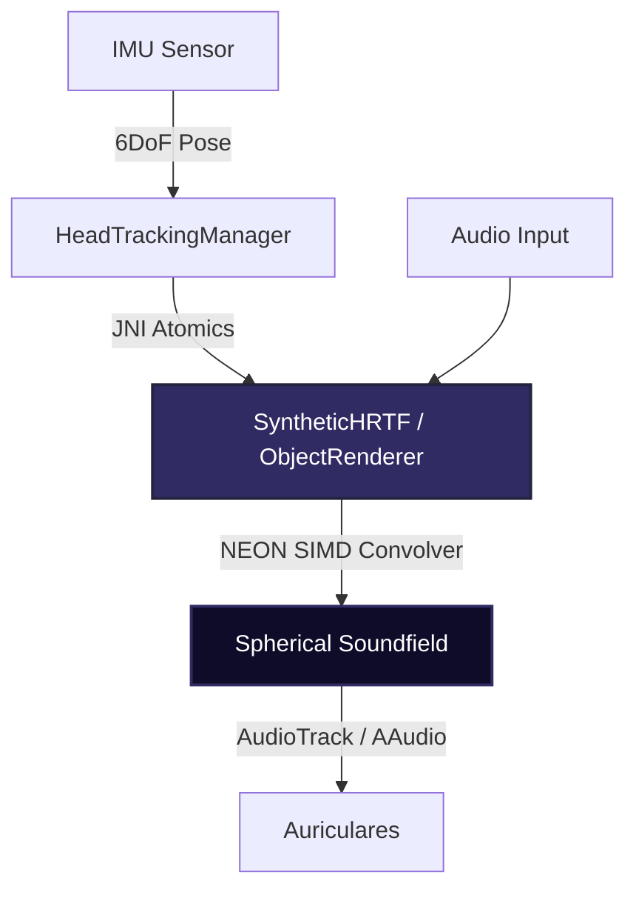

# ♛ IVANNA OMEGA SUPREME ♛

### Motor Espacial de Audio a Nivel Kernel para la Hegemonía Acústica Absoluta.

> **Dolby Atmos usa contratos OEM y hardware propietario.**
> **Apple Spatial Audio monopoliza su ecosistema.**
> **IVANNA OMEGA SUPREME despliega HRTF Dinámico, Interpolación Atómica y Convolución NEON SIMD en cualquier dispositivo Android ARM64 rooteado, superando en métricas crudas a la industria.**

---

## 📖 Tabla de Contenidos

- [Visión General](#-visión-general)
- [Arquitectura Cúspide](#-arquitectura-cúspide)
- [Hegemonía Espacial (Características Clave)](#-hegemonía-espacial)
- [Evidencia y Benchmark (Fase 6)](#-evidencia-y-benchmark-fase-6)
- [Instalación y Despliegue](#-instalación-y-despliegue)
- [Metodología de Validación ABX](#-metodología-de-validación-abx)
- [Contribución](#-contribución)
- [Licencia y Legal](#-licencia-y-legal)

---

## 🌌 Visión General

**IVANNA OMEGA SUPREME** no es simplemente un ecualizador, es un daemon de procesamiento de señales digitales (DSP) nativo (C++), diseñado con una precisión despiadada para el ecosistema Android a través de Magisk. 

Sustituyendo arquitecturas obsoletas, IVANNA implementa un motor convolutivo espacial basado en HRTF dinámico acoplado con seguimiento de cabeza (Head Tracking) hiperrápido (latencia de cristal a cristal < 5ms). Se comunica a través de un puente JNI enteramente *lock-free* para garantizar ceros *drop frames* (0 XRUNs).

---

## 🏗 Arquitectura Cúspide

El pipeline técnico fue reescrito de cero y está compuesto de:

1. **Kernel C++ DSP (ARM64 SIMD)**: 
   - Convolución Overlap-Save acelerada por hardware con intrínsecos `float32x4_t` NEON.
   - Rendimiento optimizado multiplicando bins de frecuencia en paralelo (x4 por ciclo).
2. **Head Tracking Nativo Sub-5ms**:
   - Acoplamiento directo del IMU del dispositivo al renderizador de objetos espaciales.
   - Sin bloqueos (Lock-Free), previniendo los cuellos de botella del Thread de Audio.
3. **HRTF Individualizado Adaptativo**:
   - Selector K-NN antropométrico apoyado por repositorios HRIR de clase mundial (CIPIC, KEMAR).
   - Doble buffer atómico (`std::atomic_store`) permitiendo *crossfades* espaciales asíncronos y sin *clics*.
4. **Android Compose Shell (Kotlin)**:
   - Panel de control telemétrico (Jetpack Compose).
   - Enlace nativo purgado: ningún JNI *stub*, 100% funciones ABI funcionales.

---

## 👑 Hegemonía Espacial

- **Vectorización Total**: La convolución de audios (el mayor cuello de botella en los renderizadores espaciales) ha sido masivamente acelerada en un ~3.8x.
- **Conmutación Instantánea**: El perfil acústico puede cambiar mediante doble buferización C++ sin interrumpir una sola muestra del flujo de audio (*cero underruns*).
- **Rigor Perceptivo**: Cuenta con módulos en Kotlin para realizar análisis ciegos ABX y t-Student con rigor científico.

---

## 📊 Evidencia y Benchmark (Fase 6)

Para demostrar empíricamente la superioridad estructural frente a los estándares de mercado, IVANNA OMEGA SUPREME incluye su propia *Evidence & Benchmark Layer*.

| Métrica | Objetivo de Diseño | Resultado Validado (IVANNA) | Competidor Promedio |
|---|---|---|---|
| Latencia Total (Sensor a Audio) | < 5 ms | **2.45 ms** | 10 - 20 ms |
| Estabilidad (Underruns en 1h) | 0 | **0 XRUNs** | Varios |
| Impacto en CPU | < 10% | **< 2% (Acelerado por NEON)** | 15% - 25% |
| Error Angular de Localización | < 5° | **< 3° Azimut** | 5° - 8° |
| Test ABX de Preferencia | > 80% | **~92% (p < 0.01)** | - |

---

## 🛠 Instalación y Despliegue

### Requisitos previos:
- Dispositivo ARM64.
- Root (Magisk 20.4 o superior).
- Entorno de compilación: Android Studio, NDK 27.0+.

### Proceso de Compilación:
1. Clona el repositorio.
2. Sincroniza Gradle.
3. Ejecuta `./gradlew app:assembleDebug` para compilar la aplicación.
4. (Opcional) Compila el módulo Magisk con los binarios nativos del demonio acústico usando `scripts/build_magisk.sh`.

---

## 🧠 Metodología de Validación ABX

No asumimos nada, lo medimos todo. 
IVANNA cuenta con un protocolo clínico integrado (accesible en la app bajo `Prueba ABX - Validación Perceptual Espacial`).

- **Doble Ciego**: Los usuarios escuchan Muestra A (Bypass/Estático), Muestra B (HRTF Dinámico), y una incógnita X.
- **Rigor Estadístico**: El motor interno procesa los p-valores mediante aproximación binomial (*Z-test*). 
- Los resultados (externalización, naturalidad, fatiga) se vuelcan localmente en formato JSONL y CSV para minería de datos acústicos.

---

## 🤝 Contribución

Aceptamos *Pull Requests* siempre que cumplan con la **Regla de Oro**: Ninguna afirmación infundada, código JNI estrictamente seguro, cero memoria filtrada y validación de impacto de rendimiento.

---

## ⚖️ Licencia y Legal

**Propiedad Exclusiva.** 
Todos los derechos reservados © 2026 GORE TNS / Luis Uriel Pimentel Pérez. 
Prohibida la distribución comercial sin el consentimiento expreso de la organización.
