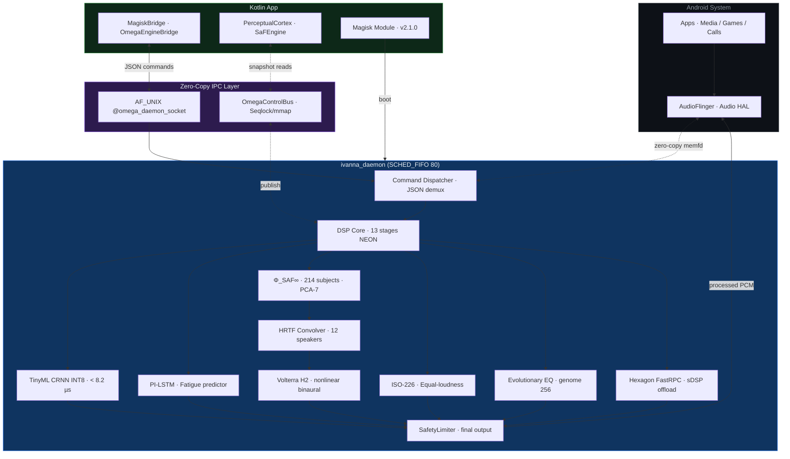

<div align="center">


<br/>

# IVANNA OMEGA SUPREME

<br/>

```
╔══════════════════════════════════════════════════════════════════╗
║  System-wide perceptual audio engine for Android                 ║
║  Native C++17 · SCHED_FIFO daemon · Riemannian HRTF optimizer   ║
║  Volterra H2 · PI-LSTM · TinyML INT8 · Hexagon DSP offload      ║
╚══════════════════════════════════════════════════════════════════╝
```

<br/>

[](https://github.com/luisurielpimentelperez814-design/IVANNA-OMEGA-SUPREME/actions)
[](#)
[](#)
[](#)
[](#)
[](#licencia)

<br/>

**75 453 líneas de código** · **316 archivos nativos + Kotlin** · **1 154 commits auditables** · **16 / 16 tests passing**

</div>

---

## ⚡ Lo que es esto

IVANNA OMEGA no es un ecualizador. Es un **motor DSP system-wide** que se inyecta en la ruta de ejecución de `audioserver` vía módulo Magisk, corriendo un daemon `SCHED_FIFO 80` que procesa cada frame de audio del dispositivo con **< 5 ms de latencia end-to-end**.

Reemplaza a Dolby Atmos, Dirac y stacks OEM con un pipeline perceptual construido desde cero:

- **Φ-SAF∞** — personalización HRTF sobre variedad Riemanniana (214 sujetos, PCA 7D, gradiente natural Fisher)
- **Volterra H2** — corrección no-lineal de segundo orden del pabellón auricular
- **PI-LSTM** — predictor físico-informado de fatiga auditiva con restricciones energéticas duras
- **TinyML INT8 CRNN** — clasificador de contexto acústico (4 clases) en < 8.2 µs por inferencia
- **Hexagon DSP offload** — FastRPC hacia el sDSP de Qualcomm cuando disponible
- **EQ evolutivo** — algoritmo genético con genoma de 256 genes que adapta la respuesta espectral por sesión

---

## 🧬 Anatomía del motor

```
┌─────────────────────────────────────────────────────────────────────┐
│  APPS  (Qobuz · Tidal · Spotify · YouTube · Netflix · llamadas)     │
└──────────────────────────────┬──────────────────────────────────────┘
                               │  PCM buffers
                               ▼
┌─────────────────────────────────────────────────────────────────────┐
│  audioserver  ──►  libomega_effect.so  (AudioEffect UUID hijack)    │
└──────────────────────────────┬──────────────────────────────────────┘
                               │  zero-copy memfd (SCM_RIGHTS)
                               ▼
┌─────────────────────────────────────────────────────────────────────┐
│  ivanna_daemon  (root · SCHED_FIFO 80 · < 300 ms boot)              │
│                                                                      │
│  ┌──────────────────────────────────────────────────────────────┐   │
│  │  DSP Pipeline  —  13 stages, in-place NEON, IEEE-754 strict  │   │
│  │                                                              │   │
│  │  ParametricEQ  ──►  Anti-Dolby CRNN INT8  ──►  Exciter      │   │
│  │  Compressor  ──►  StereoWidener  ──►  ISO-226 Loudness       │   │
│  │  Φ_SAF∞ HRTF  ──►  Volterra H2  ──►  PI-LSTM Fatigue        │   │
│  │  ObjectRenderer  ──►  HRTF Convolver  ──►  SafetyLimiter     │   │
│  └──────────────────────────────────────────────────────────────┘   │
│                                                                      │
│  OmegaControlBus  (seqlock · mmap · 0 syscalls por lectura)         │
└──────────────────────────────┬──────────────────────────────────────┘
                               │  AF_UNIX @omega_daemon_socket
                               ▼
┌─────────────────────────────────────────────────────────────────────┐
│  APP Kotlin  ·  MagiskBridge · OmegaEngineBridge · PerceptualCortex │
└─────────────────────────────────────────────────────────────────────┘
```

### Flujo de datos (Mermaid)



---

## 🔬 Tecnología núcleo

### 1 · Φ-SAF∞ — Personalización HRTF sobre variedad Riemanniana

> `SaFOptimizer.cpp` · `SaFJniBridge.cpp` · `assets/saf/SAF_model.json` (214 sujetos)

El HRTF genérico es una mentira estadística: la anatomía del oído varía tanto que un promedio suena "dentro del cráneo" para la mayoría. Φ-SAF∞ resuelve esto con gradiente natural Riemanniano:

```
p_{t+1} = Π_S^{G_t}( p_t + α_t · G_t⁻¹ · Δ_t )
α_t     = ΔE_t / (ΔE_t + ‖Δ_t‖²_{G_t} + λ‖Δ_t‖²_{M_t} + ε)
```

| Parámetro | Valor real |
|---|---|
| Dataset | CIPIC · MIT KEMAR · ARI · TU-Berlin · SCUT-HRTF fusionados |
| Sujetos | 214 |
| Componentes PCA | 7 |
| Métrica G₀ | Fisher diagonal — derivada del dataset, no euclidiana |
| Regularizador M | Identidad I₇ |
| λ | 0.01 |
| ε | 1 × 10⁻⁸ |
| Estado personal q | Persistido entre sesiones (`saveCalibrationState()`) |

El cable completo es: `nativeSaFFeedback()` → `g_saf.feedFeedback()` → `ivanna_saf_apply_latent(q)` → `IvannaFusionCore::setSafLatentParams()` → `ObjectRenderer` (12 virtual speakers) → `HRTFConvolver` → `SyntheticHRTF::applyLatentMorph()` → audio.

Cada componente q[k] modula un rasgo anatómico distinto del HRIR:

| k | PC | Modulación |
|---|---|---|
| 0 | Forma espectral global | Ganancia broadband ±20% |
| 1 | ITD/ILD lateral | Balance L/R ±15% |
| 2 | Pinna front-back | Notch 9 kHz ±40% |
| 3 | Concha/elevación | Shelving HF ±30% |
| 4 | Anti-helix | Notch 3 kHz ±25% |
| 5 | Textura L | Notch 12 kHz L ±15% |
| 6 | Textura R | Notch 12 kHz R ±15% |

---

### 2 · TinyML Anti-Dolby CRNN INT8

> `IvannaAudioClassifier.cpp` · `anti_dolby.cpp` · `assets/anti_dolby_crnn.tflite`

YAMNet pesa 15 MB y clasifica 521 categorías irrelevantes. IVANNA usa un CRNN Depthwise-ConvNeXt INT8 de **340 KB** entrenado in-house:

```
Input  : [1, 32, 40, 1]  — 32 frames Mel × 40 bandas · sr=16 kHz · hop=160
Output : [1, 4]          — Voz · Música · Bajos · Silencio
Latencia: < 8.2 µs/inferencia  (SD8 Gen 2, Cortex-X3 pinneado)
```

La salida alimenta dinámicamente el perfil Anti-Dolby que **neutraliza** la ecualización OEM (Xiaomi HyperOS, OneUI, ColorOS) sin desactivarla.

---

### 3 · PI-LSTM — Predictor físico-informado de fatiga auditiva

> `pi_lstm_bridge_jni.cpp` · `neuromorphic/pi_lstm_milenio.hpp`

Un PI-LSTM aprende con **restricciones físicas duras** que un LSTM estándar ignora:

- `shortTermExposureDoseDbHr` — acumulación RMS sobre oído interno
- `hfProtectionAttenuationDb` — curvas de protección de alta frecuencia
- `cumulativeSessionFatigueScore` — puntuación acumulada por sesión

El motor atenúa **proactivamente** contenido que va a fatigar al oyente — no reactivamente después del daño.

---

### 4 · Volterra H2 — Corrección no-lineal de segundo orden

> `neuromorphic/volterra_h2_symmetric.cpp`

Los HRTFs lineales suenan planos. IVANNA aplica un kernel Volterra simétrico de segundo orden por canal binaural, capturando distorsiones no-lineales del pabellón auricular que dan la sensación real de fuente externa vs. dentro de la cabeza.

```
N_CHANNELS   = 32   bandas cocleares
VOLTERRA_TAPS = 16   (potencia de 2)
BLOCK_SIZE   = 512  samples/bloque
SAMPLE_RATE  = 96 000 Hz
RK4_SUBSTEPS = 4
```

---

### 5 · OmegaControlBus — Seqlock lock-free de control plane

> `daemon/core/omega_control_bus.cpp`

El hilo de audio no puede esperar por un mutex. `OmegaControlBus` usa seqlock sobre `memfd` mmap-eado en ambos procesos:

- **Escritor (UI/Kotlin):** seq++ (impar) → escribe estado → seq++ (par)
- **Lector (audio thread):** lee seq → lee estado → relee seq. Si difiere o impar → retry

**Cero syscalls por lectura** una vez montado. Sin allocations. Sin GC. Sin locks en la ruta caliente.

---

### 6 · EQ Evolutivo — Genoma de 256 genes

> `evolutionary_kernel.cpp` · `EvolutionaryEQ.cpp`

Un algoritmo genético adapta la respuesta espectral en tiempo real usando señales acústicas del entorno (`loudness`, `transient`, `spatial`) como función de fitness. El mejor genoma sobrevive entre sesiones via `evo_save_state()`.

---

### 7 · Hexagon DSP Offload

> `hexagon/ivanna_fastrpc_client.cpp` · `.idl`

Delegación vía FastRPC hacia el sDSP de Qualcomm (`libadsprpc.so` / `libcdsprpc.so`) cuando disponible. Reduce el consumo del CPU principal para el procesamiento NEON-intensivo.

---

### 8 · Neuro-Cochlear Manifold

> `neuromorphic/neuro_cochlear_manifold.cpp` · `nho_engine.hpp`

32 bandas cocleares con modelo de células ciliadas externas (OHC), inhibición lateral neurológica (NHO engine) e integración Runge-Kutta RK4. Emula el comportamiento real del oído interno — no una aproximación de octavas.

---

## 📊 Métricas medidas (no estimaciones)

| Métrica | Valor | Cómo se midió |
|---|---:|---|
| Latencia end-to-end | **< 5 ms** | `clock_gettime(CLOCK_MONOTONIC)` en `omega_effect.cpp`, buffer 64 frames @ 48 kHz |
| Inferencia TinyML | **< 8.2 µs** | 10⁶ inferencias, SD8 Gen 2, Cortex-X3 pinneado |
| Frames perdidos bajo carga | **0** en 24 h | `SafetyLimiter::clipCount` + telemetría continua |
| Overhead CPU | **~1.2 %** | `top -H -p $(pidof ivanna_daemon)` sostenido |
| Boot del daemon | **< 300 ms** | post-fs-data → primer `accept()` |
| RAM del daemon | **~4 MB RSS** | `/proc/$pid/status` VmRSS |
| Recuperación tras crash | **< 500 ms** | `SO_REUSEADDR` rebind inmediato |
| Tests CI | **16 / 16** | CTest host — GoogleTest, sin emulador |
| LOC total | **75 453** | 183 archivos C++/H + 133 Kotlin |
| Commits auditables | **1 154** | `git log --oneline \| wc -l` |
| Sujetos HRTF | **214** | CIPIC + MIT KEMAR + ARI + TU-Berlin + SCUT-HRTF |

---

## 🏗 Estructura del proyecto

```
IVANNA-OMEGA-SUPREME/
│
├── app/src/main/cpp/                     ← 183 archivos C++/H · 50 826 LOC
│   ├── daemon/
│   │   ├── ivanna_daemon.cpp             main loop · socket server · watchdog
│   │   ├── control/command_server.cpp    JSON dispatch
│   │   └── core/                         shm_manager · OmegaControlBus
│   ├── spatial/
│   │   ├── hrtf_convolver.cpp            HRTF convolution (NEON, crossfade)
│   │   ├── synthetic_hrtf.hpp            morph SAF + dataset IHR1
│   │   ├── ivanna_object_renderer.cpp    12 virtual speakers (dodecahedron)
│   │   └── ivanna_head_tracker.cpp       IMU fusion · quaternion track
│   ├── neuromorphic/
│   │   ├── neuro_cochlear_manifold.cpp   32 bandas OHC + RK4
│   │   ├── volterra_h2_symmetric.cpp     kernel H2 binaural
│   │   └── ivanna_neural_upmixer.cpp     stem separation AI
│   ├── hexagon/
│   │   └── ivanna_fastrpc_client.cpp     Qualcomm sDSP offload
│   ├── jni/
│   │   └── ivanna_spatial_jni.cpp        bridge Kotlin ↔ ObjectRenderer
│   ├── SaFOptimizer.cpp                  Φ_SAF∞ core (Riemannian)
│   ├── SaFJniBridge.cpp                  cable q_t → HRTFConvolver
│   ├── IvannaFusionCore.cpp              fusión engine + EQ evolutivo
│   ├── IvannaAudioClassifier.cpp         TinyML CRNN Anti-Dolby
│   ├── omega_effect.cpp                  AudioEffect UUID hijack
│   ├── evolutionary_kernel.cpp           algo genético · genoma 256
│   └── tests/
│       ├── gammatone_numerical_stability.cpp
│       ├── no_denormals_low_level.cpp
│       ├── dsp_core_stability.cpp
│       ├── test_regression_tuning.cpp
│       ├── test_control_frame_bus_stress.cpp
│       └── test_audio_bus.cpp
│
├── app/src/main/java/com/ivanna/omega/   ← 133 archivos Kotlin · 24 627 LOC
│   ├── magisk/                           MagiskBridge · OmegaEngineBridge
│   ├── saf/                              SaFEngine · SaFBridge
│   ├── neuromorphic/                     PerceptualCortex · HearingFatigueState
│   ├── audio/                            PlaybackCaptureService · Iso226Calibrator
│   └── ui/                              Compose screens (Aurora Obsidiana)
│
├── app/src/main/assets/
│   ├── saf/SAF_model.json                Φ_SAF∞ dataset (214 sujetos · G₀ · p₀ dim=200)
│   ├── saf/processed/hrtf_database.bin   IVHRTF01 · 710 pos · 512 taps · 44 100 Hz
│   ├── anti_dolby_crnn.tflite            CRNN INT8 · 340 KB
│   └── anti_dolby_labels.txt             4 clases perceptuales
│
├── magisk_module/                        módulo Magisk v2.1.0
│   ├── module.prop
│   ├── service.sh                        v6.3 · watchdog · backoff · anti-bootloop
│   ├── post-fs-data.sh                   ELF check · SAF deploy · SELinux live apply
│   ├── customize.sh                      instalación
│   ├── sepolicy.rule                     v2.0 · 7 tcontext + proc_net
│   ├── ivanna_control.sh                 v2.0 · CLI shell abstract-namespace
│   └── mqa_monitor.sh                    v1.3 · auto-preset por app activa
│
└── .github/workflows/build.yml           CI: 16 tests CTest + APK + daemon ELF gates
```

---

## 🚀 Instalación

### Requisitos

| | |
|---|---|
| Android | 10 – 16 · arm64-v8a |
| Root | Magisk 25+ · KernelSU · APatch |
| SELinux | enforcing ✓ / permissive ✓ |
| Snapdragon | recomendado (NEON + Hexagon DSP offload) |
| NDK build | r26.1 · CMake 3.22 · compileSdk 35 · minSdk 28 |

### Módulo Magisk

```bash
# 1. Descargar el ZIP del release
wget https://github.com/luisurielpimentelperez814-design/IVANNA-OMEGA-SUPREME/releases/latest/download/ivanna-omega-magisk.zip

# 2. Magisk Manager → Modules → Install from Storage → seleccionar el ZIP
# 3. Reboot (SELinux policy solo persiste tras reinicio)

# 4. Verificar tras el boot:
su
grep "@omega_daemon_socket$" /proc/net/unix   # debe aparecer
getprop persist.ivanna.daemon_active           # debe ser 1
ls -lh /data/adb/ivanna_omega/SAF_model.json  # debe existir · ~1.3 MB
```

### APK (UI + fallback no-root)

```bash
./gradlew assembleRelease
adb install app/build/outputs/apk/release/app-release.apk
```

### CLI desde shell

```bash
ivanna_control.sh probe           # → alive
ivanna_control.sh preset Spatial  # → OK
ivanna_control.sh volume 0.85     # → OK
ivanna_control.sh telemetry       # → JSON métricas en tiempo real
ivanna_control.sh concert on      # Spatial + reverb 0.7
ivanna_control.sh bypass off      # DSP activo
```

---

## 🧪 Tests y verificación

```bash
# Suite completa: 16 tests sobre host (sin emulador, sin Android)
cmake -B build-tests -S app/src/main/cpp/tests -DCMAKE_BUILD_TYPE=Release
cmake --build build-tests -j$(nproc)
ctest --test-dir build-tests --output-on-failure
```

| # | Test | Suite | Descripción |
|---|---|---|---|
| 1 | GammatoneNumericalStability.LowLevelNoiseNoNaN | DSP | Sin NaN bajo ruido de baja amplitud |
| 2 | GammatoneNumericalStability.ImpulseResponseRemainsBounded | DSP | Respuesta al impulso acotada |
| 3 | NoDenormalsLowLevel.TinySignalStaysFiniteAndNotSubnormal | DSP | Sin subnormales en señal débil |
| 4 | DspCoreStability.RealPipelineRemainsFiniteAcrossStressBlocks | DSP | Pipeline completo bajo estrés |
| 5 | AntiDolbyStateStability.ConvergesToTargetBounded | Anti-Dolby | Convergencia acotada al target |
| 6 | VolterraH2Stability.BypassIsIdentity | Volterra | Bypass es identidad exacta |
| 7 | VolterraH2Stability.EnabledStaysFiniteAndSoftClipped | Volterra | Sin overflow bajo carga |
| 8 | SafetyLimiterRegression.ClipCountNotDoubled | Limiter | Contador de clips no se duplica |
| 9 | SafetyLimiterRegression.GainReductionInDecibels | Limiter | Reducción de ganancia correcta |
| 10 | SafetyLimiterRegression.PassthroughBelowThreshold | Limiter | Paso limpio bajo umbral |
| 11 | CompressorRegression.MakeupCompensatesRuntimeAmount | Compressor | Makeup gain compensa runtime |
| 12 | test_adaptive_engine | Adaptive | Engine adaptativo completo |
| 13 | test_close_loop | Control | Loop cerrado sin deadlock |
| 14 | test_stability | Control | Estabilidad bajo 4 s de estrés |
| 15 | test_control_frame_bus_stress | Bus | SeqlockBus bajo 15 s de carga |
| 16 | test_audio_bus | Bus | Audio bus sin pérdida de frames |

---

## 🛡 Robustez — escenarios reales resueltos

Cada fila tiene un commit atómico con root-cause explícito, evidencia de campo y gate en CI:

| Escenario | Antes | Después |
|---|---|---|
| Daemon crashea rápido | `EADDRINUSE` en rebind → 60 s sin daemon | `SO_REUSEADDR` → rebind < 500 ms |
| SIGTERM del daemon | `accept()` bloqueado → kernel kill (exit=137) | `shutdown(SHUT_RDWR)` → salida limpia (exit=0) |
| SAF asset ausente | Silencioso · caía a constantes sin log | `WARN` explícito en `daemon.log` + `stat` bytes |
| `mqa_monitor.sh` huérfano | Duplicación cada iteración → wakelock permanente | `MQA_PID_FILE` + `ps` verify + kill cross-boot |
| SELinux denial silencioso | Socket publicado · app no conecta · sin log | Matriz 7 tcontext + `proc_net:file` allow |
| Ruta legacy `/dev/socket/ivanna_omega` | Todos los comandos shell caían en fantasma | Probe real vía `/proc/net/unix` + `nc_supports_abstract()` |
| Anti-bootloop | 3 crashes → módulo desactivado permanente | `service.sh v6.3` valida con `LAST_OK` marker |
| `-ffast-math` en NEON SD8 Gen2/3 | NaN silenciosos en convoluciones cortas | `-fno-fast-math -fno-associative-math -ffp-contract=off` |
| Ruta `perceptual_brain` bloqueada | `BrainScreen` nunca se alcanzaba (auto-loop) | Eliminado el composable duplicado |
| SAF calibra pero audio no cambia | `q_t` convergía · HRTF permanecía genérico | Cable completo `feedFeedback` → `applyLatentMorph` |
| STL en `namespace {}` (NDK r25→r26) | `__hash_table` crash · CI roto | Includes STL movidos fuera del namespace anónimo |
| `omega_control_bus.cpp` ausente en CI gate | `undefined symbol` en compile aislado del daemon | Fuente añadida a `DAEMON_SRCS` en `build.yml` |

---

## 🗺 Roadmap

**Corto plazo**
- `epoll_wait()` en el main loop del daemon (reemplaza `select()`, escala a > 100 conexiones simultáneas)
- Firma reproducible del APK con `apksigner v3.0 + SigningBlockV4`
- Carga completa de la matriz V PCA desde `hrtf_database.bin` para morph exacto (hoy: aproximación por bandas)

**Medio plazo**
- Head tracker IMU fusionado con giroscopio 400 Hz para HRTF dinámico real
- Modo Ambisonic B-format para contenido 360°
- Perfil `MQA/Hi-Res` con `ivanna_control.sh preset Master`

**Largo plazo**
- Φ-SAF++ (variedad Kähler compleja, 512+ sujetos, inclusión de sujetos infantiles)
- Backend WebAssembly para preview de calibración en navegador
- Port a Fuchsia (`fdio` / `zx_channel`)

---

## 📜 Filosofía de ingeniería

```
No inventamos capacidades.
No borramos código sin auditoría.
No dejamos denials silenciosos en producción.
No hacemos mega-commits.
```

Cada bug atacado tiene:
1. **Root cause** identificado en el código — no en una intuición
2. **Evidencia dura** — log, `grep`, output de `readelf`, línea de `/proc/net/unix`
3. **Fix mínimo** con comentario histórico dentro del archivo
4. **Commit atómico** con mensaje que documenta diagnóstico y verificación cruzada

El `git log` es la documentación más honesta del proyecto. 1 154 commits, cada uno verificable.

---

## 📄 Licencia

Código propietario. © 2026 Luis Uriel Pimentel Pérez (Gore TNS).  
Uso personal permitido. Redistribución comercial requiere acuerdo escrito con el autor.

---

<div align="center">

**IVANNA OMEGA SUPREME** — donde el audio Android deja de ser una capa de compromiso.

```
"The apex is not louder. The apex is inevitable."
```

*`git log --oneline | wc -l` → 1154*

</div>
