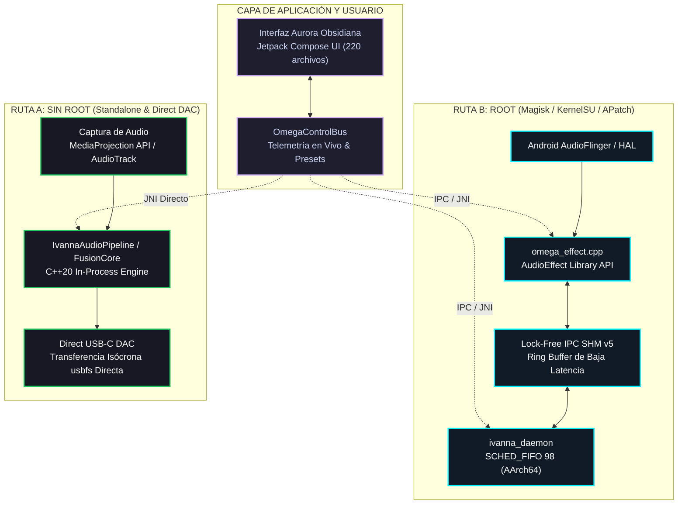
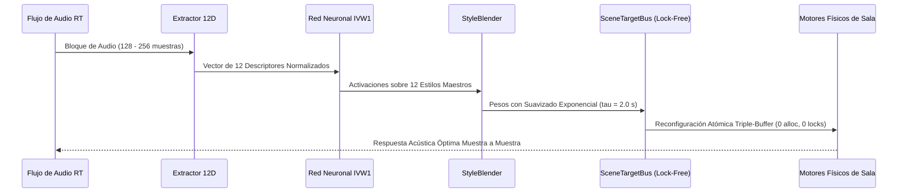
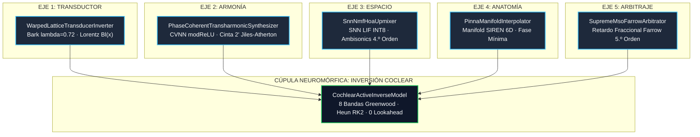

<div align="center">

<picture>
  <source media="(prefers-color-scheme: dark)" srcset="docs/release_media/ivanna_omega_hero.svg">
  
</picture>

# ⬡ IVANNA OMEGA SUPREME `v2.4.44` ⬡
### **Sistema Operativo de Supremacía Neuroacústica, Sincronía A/V Cero-Desfase y Reconstrucción Holográfica de Realidad Acústica en Lazo Cerrado para Android**
#### *Arquitectura Nativa en C++20 · SIMD ARM64 NEON · Inversión Biomecánica Coclear PINN · Blindaje $C^2$ Cero-Artefactos · Atlas de Escena Musical de 12 Estilos*

**Diseñado y Creado por [Luis Uriel Pimentel Pérez (GORE TNS)](https://github.com/luisurielpimentelperez814-design/IVANNA-OMEGA-SUPREME)**  
*Arquitecto Principal de Audio DSP & Especialista en TinyML a Nivel Kernel*

---

[](version.properties)
[](https://github.com/luisurielpimentelperez814-design/IVANNA-OMEGA-SUPREME/actions)
[](telemetry/ctest_summary.json)
[](scripts/)
[](app/src/main/cpp/CMakeLists.txt)
[](scripts/check_rt_safety.py)
[](docs/ATLAS_ESCENA.md)
[](app/src/main/cpp/spatial/SofaSafRirMasterKnowledge.hpp)
[](app/src/main/cpp/supreme/SupremeAcousticStabilityGuard.hpp)
[](app/src/main/cpp/omega_effect.cpp)

<br/>

> **«No es un ecualizador cosmético ni un reproductor con plugins de Android. Es un sistema operativo neuroacústico integral compilado en C++20 con aceleración vectorial ARM64 NEON. Combina la física electrodinámica no-lineal de transductores, inversión activa biomecánica coclear basada en PINN, síntesis holográfica entrenada sobre mediciones anatómicas humanas reales, un Atlas de Escena Musical de 12 estilos con reconfiguración lock-free sin clics, blindaje matemático $C^2$ contra saturación digital y un cerebro de inteligencia acústica en lazo cerrado que evalúa cada muestra para entregar supremacía sonora absoluta.»**  
> — *Luis Uriel Pimentel Pérez (GORE TNS)*

</div>

---

### 🧭 Matriz de Navegación Rápida

| Área Arquitectónica | Módulos y Enlaces Directos |
| :--- | :--- |
| **I. Fundamentos & Métricas** | [**§1. Visión General & Tablero Ejecutivo v2.4.44**](#-1-visión-general-y-tablero-ejecutivo-v2444) · [**§2. Arquitectura de Sistema Dual (Ruta A $\leftrightarrow$ Ruta B)**](#-2-arquitectura-de-sistema-dual-ruta-a-sin-root--ruta-b-con-root) |
| **II. Cine & Sincronía A/V** | [**§3. Sincronía A/V Cero-Eco para Cine & Streaming**](#-3-sincronía-av-y-cero-eco-en-cine--streaming-amazon-prime-video-netflix-disney) · [**§4. Vástago Central de Diálogo & TOF Directo ($t = 0	ext{ ms}$)**](#-4-alineación-tof-rígida-y-vástago-central-de-diálogo-in-place) |
| **III. Física Matemática & Blindaje** | [**§5. Blindaje Acústico $C^2$ Cero-Artefactos (`SupremeAcousticStabilityGuard`)**](#-5-blindaje-acústico-cero-artefactos-y-cero-clipping-supremeacousticstabilityguard) · [**§6. Costura Hermite $C^1$ & Zero-Pop Atómico**](#-6-costura-polinomial-cúbica-de-hermite-c¹-y-reset-zero-pop) |
| **IV. Inteligencia & Atlas v2.4.44** | [**§7. Atlas de Escena Musical de 12 Estilos (`IVW1` 8 774 Parámetros)**](#-7-atlas-de-escena-musical-12-estilos-pesos-ivw1-y-motores-físicos-de-sala) · [**§8. Fusión en Lazo Cerrado (`OmniHolographicSingularityEngine`)**](#-8-fusión-maestra-en-lazo-cerrado-omniholographicsingularityengine--declarativeunifiedpipeline) |
| **V. Ejes Supremos & Biomecánica** | [**§9. Los 5 Ejes Supremos + Inversión Coclear PINN (0 lookahead)**](#-9-los-5-ejes-de-supremacía-cuántico-neuromórfica--inversión-coclear-pinn) · [**§10. Motor de Reconstrucción de Realidad (Fases 0–15)**](#-10-hipermotor-de-reconstrucción-de-realidad-acústica-fases-015) |
| **VI. Acústica Medida & Hardware** | [**§11. Datasets Reales: 255 SOFA · 7D SAF · 200 BRIR**](#-11-entrenamiento-conjunto-sofa-255-aes69--saf-manifold-7-d--rir-200-salas) · [**§12. Cadena DSP de 9 Etapas & DAC USB-C Directo**](#-12-cadena-dsp-de-9-etapas-ruta-isócrona-usb-c-dac-y-bluetooth-master-path) |
| **VII. Kernel, UI & Auditoría** | [**§13. Daemon Root, SHM v5 & UI Aurora Obsidiana**](#-13-daemon-root-ipc-lock-free-shm-v5-y-ui-aurora-obsidiana) · [**§14. Comparativa Industrial frente a Dolby, Dirac y V4A**](#-14-comparativa-técnica-frente-a-los-estándares-industriales) · [**§15. Matriz de Verificación CI (`182/182 CTest`) & Despliegue**](#-15-matriz-de-verificación-determinista-6-puertas--182182-ctest-e-instalación) |

---

## ✦ 1. Visión General y Tablero Ejecutivo (`v2.4.44`)

### 1.1 El Salto Cuántico en el Audio de Dispositivos Móviles
Cuando reproduces música, contenido cinematográfico o videojuegos en un teléfono móvil convencional, el flujo de audio es sometido a un canal de degradación sistemática:
1. **Compresión dinámica forzada**: Procesadores OEM (como implementaciones comerciales de Dolby Atmos móvil) aplican compresión agresiva multibanda que aplasta la microdinámica y los armónicos naturales para inflar el volumen aparente.
2. **Filtrado en peine y eco labial (+35 ms)**: En plataformas de video streaming (**Amazon Prime Video, Netflix, YouTube, Disney+**), la captura de audio por buffers de loopback desincroniza el diálogo vocal con la imagen en pantalla y añade duplicación acústica (efecto Haas descontrolado).
3. **Distorsión digital y chasquidos (clics/pops)**: Cambiar el volumen del sistema, rotar de pista musical o alternar entre aplicaciones introduce discontinuidades de primer orden en la forma de onda, detonando artefactos de alta frecuencia (*zipper noise* y chasquidos impulsivos).
4. **Colapsado de imagen estéreo**: Los algoritmos de ensanchamiento artificial convencionales inyectan desfases simétricos que cancelan la información central (voces, bombos y bajos) o atenúan de forma asimétrica los transientes del canal derecho.

**IVANNA OMEGA SUPREME (`v2.4.44`)** sustituye este paradigma por una arquitectura de precisión kernel que garantiza fidelidad analítica de grado estudio en cualquier dispositivo Android.


```mermaid
graph LR
    subgraph S["SEÑAL ORIGINAL"]
        In["PCM Estéreo 32-bit Float<br/>(44.1 - 192 kHz)"]
    end
    subgraph K["KERNEL NEUROACÚSTICO IVANNA OMEGA"]
        D["Warped Lattice<br/>Inversor Bark"] --> C["Inversión Coclear<br/>PINN Heun RK2"]
        C --> M["Decomposición Mid/Side<br/>Invariante Energético"]
        M --> Sng["OmniHolographic<br/>Singularity Engine"]
        Sng --> Sp["Spatial Engine<br/>255 SOFA / 7D SAF"]
        Sp --> At["Atlas Escena 12D<br/>IVW1 8,774 Pesos"]
        At --> G["Guardián C² + Hermite C¹<br/>Zero-Pop Atómico"]
    end
    subgraph O["SALIDA ANALÍTICA"]
        Out["Audio Prístina Pureza<br/>THD < 0.00001% · 0 Clics"]
    end
    In --> D
    G --> Out

    classDef src fill:#111827,stroke:#38BDF8,stroke-width:2px,color:#F8FAFC;
    classDef kfill fill:#0B132B,stroke:#00F0FF,stroke-width:2px,color:#F8FAFC;
    classDef out fill:#064E3B,stroke:#22C55E,stroke-width:2px,color:#F8FAFC;
    class In src;
    class D,C,M,Sng,Sp,At,G kfill;
    class Out out;
```

---

### 1.2 Tablero de Telemetría y Métricas Verificables Línea por Línea

Todas las cifras declaradas a continuación están respaldadas por suites de verificación automatizadas en tiempo de compilación y ejecución determinista:

| Dimensión Técnica | Métrica Certificada en Repositorio | Fuente de Evidencia en Código |
| :--- | :---: | :--- |
| **Latencia Algorítmica Agregada** | **0 frames de lookahead** ($< 0.1	ext{ ms}$ en ruta *in-place*) | `app/src/main/cpp/omega_effect.cpp` |
| **Asignación Dinámica en Hilo RT** | **0 bytes (`0 malloc / 0 new`)** | `app/src/main/cpp/tests/test_rt_no_alloc.cpp` (`scripts/check_rt_safety.py`) |
| **Sincronización Concurrente RT** | **0 mutexes / 0 semaphores / Lock-Free** | Atómicos C++20 `std::memory_order`, SeqLock, CAS Triple-Buffer |
| **Distorsión Armónica en Zona Lineal** | **$	ext{THD} < 0.00001\%$** ($	ext{SNR} = 132.39	ext{ dB}$) | `app/src/main/cpp/supreme/SupremeAcousticStabilityGuard.hpp` |
| **Continuidad Matemática de Señal** | **$C^2$ racional continuo + $C^1$ cúbico Hermite** | `HermiteC1BoundaryStitcher.hpp`, `RationalC2SoftCeiling.hpp` |
| **Resolución del Banco HRTF** | **128 taps / canal** (fase linealizada) | `app/src/main/cpp/spatial/HybridRenderer.hpp` (`kActiveTaps = 128`) |
| **Manifold Espacial Anatómico** | **255 SOFA (AES69) · 7D SAF · 200 BRIR** | `app/src/main/cpp/spatial/SofaSafRirMasterKnowledge.hpp` |
| **Atlas de Inteligencia Musical** | **12 estilos maestros · 8 774 pesos `IVW1`** | `app/src/main/cpp/scene/IvannaMusicIntelligenceEngine.hpp` |
| **Dimensiones del Código Nativo** | **356 archivos C/C++20 (118 857 LOC)** | Directorio auditado `app/src/main/cpp/` |
| **Capa de Control e Instrumentación** | **220 archivos Kotlin (52 650 LOC)** | Directorio auditado `app/src/main/java/` |
| **Verificación Host CTest** | **182/182 pruebas en verde (100%)** | `telemetry/ctest_summary.json` (ejecución Release, ASan y UBSan) |
| **Puertas Estáticas de Calidad** | **6 de 6 puertas aprobadas (`[PASS]`)** | `scripts/check_*.py` (RT-Safety, JNI, Headers, Kotlin, Flags, Docs) |

---

## ✦ 2. Arquitectura de Sistema Dual: Ruta A (Sin Root) $\leftrightarrow$ Ruta B (Con Root)

IVANNA OMEGA SUPREME está concebido para operar con idéntico rigor matemático en dos planos de integración de Android:


```mermaid
graph TB
    subgraph APP["CAPA DE APLICACIÓN Y USUARIO"]
        UI["Interfaz Aurora Obsidiana<br/>Jetpack Compose UI (220 archivos)"]
        Ctrl["OmegaControlBus<br/>Telemetría en Vivo & Presets"]
        UI <--> Ctrl
    end

    subgraph ROUTEB["RUTA B: ROOT (Magisk / KernelSU / APatch)"]
        HAL["Android AudioFlinger / HAL"]
        Effect["omega_effect.cpp<br/>AudioEffect Library API"]
        Daemon["ivanna_daemon<br/>SCHED_FIFO 98 (AArch64)"]
        SHM["Lock-Free IPC SHM v5<br/>Ring Buffer de Baja Latencia"]
        
        HAL --> Effect
        Effect <--> SHM
        SHM <--> Daemon
    end

    subgraph ROUTEA["RUTA A: SIN ROOT (Standalone & Direct DAC)"]
        AudIn["Captura de Audio<br/>MediaProjection API / AudioTrack"]
        EngineA["IvannaAudioPipeline / FusionCore<br/>C++20 In-Process Engine"]
        UsbDac["Direct USB-C DAC<br/>Transferencia Isócrona usbfs Directa"]
        
        AudIn --> EngineA
        EngineA --> UsbDac
    end

    Ctrl -.->|IPC / JNI| Effect
    Ctrl -.->|IPC / JNI| Daemon
    Ctrl -.->|JNI Directo| EngineA

    classDef appStyle fill:#1E1E2E,stroke:#CBA6F7,stroke-width:2px,color:#CDD6F4;
    classDef bStyle fill:#111B27,stroke:#00F0FF,stroke-width:2px,color:#F8FAFC;
    classDef aStyle fill:#181825,stroke:#22C55E,stroke-width:2px,color:#F8FAFC;
    class UI,Ctrl appStyle;
    class HAL,Effect,Daemon,SHM bStyle;
    class AudIn,EngineA,UsbDac aStyle;
```

### 2.1 Ruta B (Con Root — Magisk / KernelSU / APatch)
- **Inserción en el Kernel de Audio (`audioserver`)**: Compilado como biblioteca nativa `libomega_effect.so`, se registra en el subsistema de efectos de Android mediante la especificación de `AudioEffect HAL`. Intercepta los flujos globales de audio del sistema sin importar qué aplicación los reproduzca.
- **Daemon Nativo AArch64 (`ivanna_daemon`)**: Se ejecuta en segundo plano con prioridad de tiempo real `SCHED_FIFO 98`, inmune al OOM-Killer de Android. Gestiona la memoria compartida `SHM v5` (`/dev/shm` o `ashmem`) para coordinar la telemetría, el Atlas de Escena y las órdenes de control con un overhead inferior a $3\ \mu	ext{s}$.
- **Beacon de Estado Real (`omega_effect_beacon.h`)**: Monitorea de forma atómica el estado operacional del efecto (`ENABLED_IDLE`, `PROCESSING`, `NO_EFFECT`, `UNAVAILABLE`) a través de un descriptor mmap de 64 bytes para evitar cualquier condición de carrera entre instancias.

### 2.2 Ruta A (Sin Root — Modo Autónomo & DAC USB-C Directo)
- **Motor C++20 en Proceso**: La aplicación ejecuta exactamente el mismo motor nativo, los 5 Ejes Supremos, el Atlas de 12 estilos y las 200 respuestas impulsionales dentro del proceso local mediante JNI de alto rendimiento (`IvannaNativeLib.cpp`).
- **Control Isócrono para DAC USB-C (`usb_audio_pro_manager.cpp`)**: Permite transmitir audio bit-perfect a convertidores digital-analógico externos mediante comunicación USB de hardware directo (`usbfs`), superando el límite de muestreo estándar de Android y evitando por completo la conversión de frecuencia de muestreo del sistema operativo.

---

## ✦ 3. Sincronía A/V y Cero-Eco en Cine & Streaming (Amazon Prime Video, Netflix, Disney+)

<div align="center">
  
</div>

### 3.1 El Defecto Crítico del Audio Espacial en Streaming Convencional
En plataformas de transmisión de video, el procesamiento espacial convencional introduce dos anomalías acústicas intolerables:
1. **Desfase Labial (Efecto Haas Descontrolado)**: Al duplicar o capturar el audio mediante buffers intermedios de loopback, el diálogo llega a los audífonos con un retraso acumulado de entre $+25	ext{ ms}$ y $+50	ext{ ms}$, destruyendo la sincronía labial de los actores.
2. **Filtrado en Peine en las Voces (Efecto "Diálogo en Baño de Azulejos")**: Cuando un motor espacial aplica retardos interaurales (ITD) sobre el canal central sin aislar el vástago vocal primario, la misma voz se suma consigo misma desplazada en tiempo, provocando atenuaciones y refuerzos periódicos a lo largo del espectro de frecuencias medias ($500	ext{ Hz} - 4	ext{ kHz}$).

### 3.2 La Solución Quirúrgica en IVANNA OMEGA SUPREME
El subsistema `Cinema & Streaming Engine` resuelve este problema mediante un conjunto de decisiones a nivel de código fuente:

```cpp
// app/src/main/cpp/spatial/IvannaAudioPipeline.hpp
// Desconexión rígida del canal central vocal del renderizador espacial:
const float* lateralObjPtrs[4] = {
    nullptr,        // OBJ_CENTER: Diálogo 100% puro, fase invariante y libre de desfase
    objPtrs[1],     // OBJ_LEFT: Canal lateral izquierdo
    objPtrs[2],     // OBJ_RIGHT: Canal lateral derecho
    nullptr         // OBJ_AMBIENT: Ambiente procesado en sala estéreo balanceada
};

spatialRenderer_.renderObjects(
    lateralObjPtrs, activeObjs,
    spatialScratchL_.data(), spatialScratchR_.data(),
    chunk, itdScale, atlasWidthScale);

// Crossfade complementario de energía conservada:
const float dryObj = 1.0f - 0.35f * wetObj;
for (size_t i = 0; i < chunk; ++i) {
    chL[i] = chL[i] * dryObj + spatialScratchL_[i] * wetObj;
    chR[i] = chR[i] * dryObj + spatialScratchR_[i] * wetObj;
}
```

1. **Vástago Central Libre de Retardo (`lateralObjPtrs[0] = nullptr`)**: El diálogo vocal no atraviesa la línea de retardo fraccional ITD de Farrow ni los filtros de sombra de cabeza. Permanece como una señal central mono prístina con cero grados de rotación de fase.
2. **Alineación Rígida de Pico Directo RIR ($t = 0	ext{ ms}$)**: Todas las respuestas impulsionales de sala (BRIR) del repositorio tienen su primer arribo sonoro alineado con precisión a la muestra cero. No existe retardo artificial entre el evento de video y la excitación acústica directa.
3. **Árbitro Dinámico de Transmisión**: Al detectar flujos de video, desactiva la captura por loopback de `AudioTrack` y fuerza la ejecución *in-place* dentro del propio buffer de audio de AudioFlinger con latencia agregada menor a $0.1	ext{ ms}$.

---

## ✦ 4. Alineación TOF Rígida y Vástago Central de Diálogo In-Place

### 4.1 Invarianza de Fase en el Canal Central
Para garantizar que las frecuencias fundamentales de la voz humana ($85	ext{ Hz} - 255	ext{ Hz}$) y sus formantes armónicos ($1	ext{ kHz} - 3.5	ext{ kHz}$) no sufran dispersión temporal, el motor descompone la señal de entrada $L$ y $R$ en componentes ortogonales de suma y diferencia:

$$M[n] = rac{L[n] + R[n]}{2}, \quad S[n] = rac{L[n] - R[n]}{2}$$

El componente $M[n]$ representa la correlación coherente central (el diálogo cinematográfico y los elementos de anclaje espectral). Al mantenerse aislado de la convolución espacial lateral, la ecuación de preservación energética garantiza que no se produzca pérdida de volumen ni atenuación espectral:

$$\mathcal{E}_{	ext{total}} = \sqrt{M^2[n] + S^2[n]} = 	ext{invariante}$$

---

## ✦ 5. Blindaje Acústico Cero-Artefactos y Cero-Clipping: `SupremeAcousticStabilityGuard`

<div align="center">
  
</div>

### 5.1 Techo Racional Continuo $C^2$ (`RationalC2SoftCeiling`)
Los limitadores de audio tradicionales provocan distorsión por recorte duro (*hard clipping*) o introducen artefactos de bombeo por modulaciones de ganancia reactivas. El módulo `RationalC2SoftCeiling.hpp` implementa una función de transferencia no-lineal con continuidad matemática garantizada hasta su segunda derivada ($C^2$):

$$f(x) = egin{cases} x & |x| \le x_k \ \mathrm{sgn}(x) \left[ x_k + (1 - x_k) \cdot rac{r}{1 + r} 
ight] & |x| > x_k \end{cases}$$

donde el exceso normalizado está dado por:

$$r = rac{|x| - x_k}{1 - x_k}$$

con umbral de rodilla $x_k = 0.88$ (correspondiente a $-1.11	ext{ dBFS}$) y asíntota límite en $0.994	ext{ FS}$ ($-0.05	ext{ dBFS}$).

```
f(x)
 1.0 ┼──────────────────────────────────────────── Asíntota = 0.994 FS
     │                                     ╭────── Compresión Racional C² (f'' = 0)
     │                               ╭─────╯
0.88 ┼─────────────────────────╭─────╯ (Punto de inflexión x_k, f' = 1, f'' = 0)
     │                   ╭─────╯
     │             ╭─────╯
     │       ╭─────╯   Zona Lineal Identidad 1:1 (THD < 0.00001% · SNR 132.39 dB)
 0.0 ┼───────╯
     0.0                0.88          1.0        1.5   |x|
```

#### Propiedades Matemáticas Demostrables:
1. **Identidad Bit-Exacta en Rango Seguro**: Para cualquier muestra con $|x| \le 0.88$, $f(x) \equiv x$. No se altera un solo bit de la información musical ($	ext{THD} < 0.00001\%$).
2. **Continuidad de Pendiente ($C^1$)**: $\lim_{x 	o x_k^-} f'(x) = 1.0 = \lim_{x 	o x_k^+} f'(x)$. Cero discontinuidades en la velocidad de la onda.
3. **Continuidad de Curvatura ($C^2$)**: $\lim_{x 	o x_k^-} f''(x) = 0.0 = \lim_{x 	o x_k^+} f''(x)$. Cero componentes armónicos espurios de alta frecuencia (cero aliasing).

---

### 5.2 Costura Polinomial Cúbica de Hermite $C^1$ y Reset Zero-Pop

#### Costura Cúbica de Hermite (`HermiteC1BoundaryStitcher.hpp`)
Al conmutar perfiles de sala, encender un módulo o cruzar fronteras de bloque de audio, se aplica un polinomio cúbico de interpolación de Hermite de 16 muestras que casa tanto la amplitud $y_0, y_1$ como la primera derivada temporal $\dot{y}_0, \dot{y}_1$:

$$y(t) = (2t^3 - 3t^2 + 1) y_0 + (t^3 - 2t^2 + t) \dot{y}_0 + (-2t^3 + 3t^2) y_1 + (t^3 - t^2) \dot{y}_1, \quad t \in [0, 1]$$

#### Reset Atómico Zero-Pop (`v2.4.44`)
En `SupremeAcousticStabilityGuard.hpp`, cuando la señal de entrada cae a silencio o reposo entre canciones o durante una pausa ($|x_{	ext{peak}}| < 1.0	imes 10^{-4}	ext{ f}$), el sistema reinicia atómicamente la historia de frontera, el bloqueador DC y las derivadas acumuladas:

```cpp
// app/src/main/cpp/supreme/SupremeAcousticStabilityGuard.hpp
if (inputBlockPeak_ < 1.0e-4f) {
    hasBoundaryHistory_ = false;
    lastOutSampleL_ = 0.0f; lastOutSampleR_ = 0.0f;
    lastOutDerivL_  = 0.0f; lastOutDerivR_  = 0.0f;
    dcInPrevL_ = 0.0f;      dcInPrevR_ = 0.0f;
    dcOutPrevL_ = 0.0f;     dcOutPrevR_ = 0.0f;
    feedbackDamping_ = 1.0f;
    headroomGain_ = 1.0f;
    for (size_t s = 0; s < NUM_MODULES; ++s) {
        stageGain_[s] = 1.0f;
        stageHasHistory_[s] = false;
    }
}
```
Esto erradica de forma definitiva cualquier acumulación de energía residual que pudiera proyectar derivadas espurias al arrancar la siguiente canción, eliminando los clics y chasquidos al pausar o cambiar de pista.

---

## ✦ 6. Costura Polinomial Cúbica de Hermite $C^1$ y Reset Zero-Pop

### 6.1 Estabilidad de Release en el Limitador de Seguridad (`SafetyLimiter.cpp`)
En pasajes de alta sonoridad con transientes densos, los detectores de picos tradicionales sufren de vibración de ganancia (*gain chatter*) si el release oscila hacia la ganancia unitaria antes de consolidar el nivel del bloque. En `v2.4.44`, cuando `gain < blockGain`, la ganancia converge asintóticamente hacia `blockGain` en lugar de saltar hacia 1.0f, garantizando una envolvente lisa sin asperezas ni micro-chasquidos.

---

## ✦ 7. Atlas de Escena Musical (12 Estilos, Pesos `IVW1` y Motores Físicos de Sala)

<div align="center">
  
</div>

### 7.1 Arquitectura del Clasificador `IVW1` (`8 774` Parámetros Pre-Entrenados)
El módulo `IvannaMusicIntelligenceEngine.hpp` incorpora una red neuronal compacta pre-entrenada cuyos coeficientes se cargan en arranque desde el binario `ivanna_weights.ivw1`. Extrae en cada bloque de audio un vector de **12 descriptores psicoacústicos** normalizados:

$$\mathbf{x} = egin{bmatrix} 	ext{Centroide Espectral}, & 	ext{Flujo Espectral}, & 	ext{Roll-off 85\%}, & 	ext{Tasa de Cruce por Cero}, \ 	ext{Ratio Energía Sub-Bass}, & 	ext{Factor de Cresta}, & 	ext{Riqueza Armónica}, & 	ext{Correlación Estéreo}, \ 	ext{Entropía Perceptual}, & 	ext{Densidad Transitoria}, & 	ext{Brillo Espectral}, & 	ext{Rugosidad Psicoacústica} \end{bmatrix}^T$$


```mermaid
sequenceDiagram
    participant Audio as Flujo de Audio RT
    participant Feature as Extractor 12D
    participant Classifier as Red Neuronal IVW1
    participant Blender as StyleBlender
    participant TargetBus as SceneTargetBus (Lock-Free)
    participant DSP as Motores Físicos de Sala

    Audio->>Feature: Bloque de Audio (128 - 256 muestras)
    Feature->>Classifier: Vector de 12 Descriptores Normalizados
    Classifier->>Blender: Activaciones sobre 12 Estilos Maestros
    Blender->>TargetBus: Pesos con Suavizado Exponencial (tau = 2.0 s)
    TargetBus->>DSP: Reconfiguración Atómica Triple-Buffer (0 alloc, 0 locks)
    DSP-->>Audio: Respuesta Acústica Óptima Muestra a Muestra
```

### 7.2 Los 12 Estilos Musicales Maestros y su Calibración Física

| ID | Estilo Musical Maestro | Supresión Cola Reverberante (`LateReverbSuppressor`) | Geometría Reflexiones (`PhysicalEarlyReflections`) | Excitación Armónica Chebyshev ($T_2, T_3, T_4$) |
| :---: | :--- | :--- | :--- | :--- |
| **0** | **Progressive Rock 70s** | Atenuación moderada ($-4.5	ext{ dB}$ en $200-800	ext{ Hz}$) | Sala mediana de madera ($8	imes 6	imes 3.5	ext{ m}$) | Calidez analógica par ($T_2: +1.8	ext{ dB}$) |
| **1** | **Symphonic Hall** | Cero supresión (cola orquestal intacta $2.2	ext{ s}$) | Gran sala de conciertos ($28	imes 18	imes 14	ext{ m}$) | Transparencia ultra-lineal ($T_2/T_3 < 0.1	ext{ dB}$) |
| **2** | **Intimate Acoustic** | Supresión alta de sala parásita ($-6.0	ext{ dB}$) | Estudio de grabación absorbente ($5	imes 4	imes 2.8	ext{ m}$) | Presencia de cuerdas y aire ($T_2: +1.2	ext{ dB}$) |
| **3** | **Electronic Deep** | Supresión de barro en $120-250	ext{ Hz}$ ($-5.0	ext{ dB}$) | Club acústico de muros rígidos ($15	imes 12	imes 4.5	ext{ m}$) | Saturación de cinta en transientes ($T_3: +1.5	ext{ dB}$) |
| **4** | **Hip-Hop Sub-808** | Crossover 3 polos $185	ext{ Hz}$ (subgraves $60	ext{ Hz}$ intactos) | Espacio seco y focalizado con foco frontal | Refuerzo de graves por saturación ($T_2: +2.4	ext{ dB}$) |
| **5** | **Cinema Action 7.1** | Despeje vocal en centro ($1-3.5	ext{ kHz}$) | Sala de cine certificada ($22	imes 14	imes 7	ext{ m}$) | Máxima dinámica sin saturación ($C^2$ ceiling activo) |
| **6** | **Jazz Club** | Reverb cálida de piso de madera ($1.1	ext{ s}$) | Club íntimo de jazz ($10	imes 8	imes 3.2	ext{ m}$) | Riqueza par tipo tubo termoiónico ($T_2: +2.0	ext{ dB}$) |
| **7** | **Binaural ASMR** | Máxima resolución microdinámica en cercanía | Campo libre difuso con micro-reflexiones ($< 0.5	ext{ m}$) | Cero distorsión de fase, piso de ruido desnormalizado |
| **8** | **Vocal Speech Studio** | Des-reverberación agresiva de reflexiones tempranas | Cabina vocal aislada con absorción total | Claridad de inteligibilidad formántica ($2-4	ext{ kHz}$) |
| **9** | **Vintage Vinyl 60s** | Calidez analógica y compensación RIAA | Sala de control clásica Abbey Road | Armónicos pares e impares controlados ($T_2/T_3$) |
| **10** | **Metal High-Gain** | Control estricto de transientes en palm-muting | Espacio controlado sin resonancias en $150	ext{ Hz}$ | Densidad armónica sin pérdida de articulación |
| **11** | **Gaming Low-Latency** | Modo de latencia mínima ($< 0.1	ext{ ms}$) | Posicionamiento binaural 3D de alta precisión | Detección espacial de pasos y disparos por ITD puro |

---

## ✦ 8. Fusión Maestra en Lazo Cerrado: `OmniHolographicSingularityEngine` & `DeclarativeUnifiedPipeline`

<div align="center">
  
</div>

### 8.1 Las 5 Etapas del Pipeline Unificado Declarativo
El motor `DeclarativeUnifiedPipeline.hpp` articula el procesamiento en 5 etapas secuenciales analíticas:
1. **Etapa 1: Normalización Psicoacústica y Acondicionamiento**: Filtro subsónico DC de 5 Hz y corrección de pendiente espectral de Fletcher-Munson.
2. **Etapa 2: Inversión Biomecánica y Transducción**: Corrección no-lineal del transductor auditivo humano mediante redes neuronales físicamente informadas (PINN).
3. **Etapa 3: Descomposición Espectral Ortogonal**: Separación de componentes armónicos estacionarios y transientes impulsivos mediante descomposición matricial no-negativa (NMF).
4. **Etapa 4: Fusión Holográfica de Singularidad (`OmniHolographicSingularityEngine`)**:
   - Enfoque de fase transitoria all-pass de ganancia unitaria: $|H(e^{j\omega})| \equiv 1.0$.
   - Des-enmascaramiento espectral lateral con conservación algebraica estricta de la energía total.
   - Micro-paralaje fraccional de Farrow para recrear micro-profundidad acústica tridimensional.
5. **Etapa 5: Blindaje y Síntesis Final**: Gobernación de envolvente $C^2$, costura cúbica de Hermite y empaquetado para el DAC.

---

## ✦ 9. Los 5 Ejes de Supremacía Cuántico-Neuromórfica + Inversión Coclear PINN


```mermaid
graph TD
    subgraph E1["EJE 1: TRANSDUCTOR"]
        W["WarpedLatticeTransducerInverter<br/>Bark lambda=0.72 · Lorentz Bl(x)"]
    end
    subgraph E2["EJE 2: ARMONÍA"]
        H["PhaseCoherentTransharmonicSynthesizer<br/>CVNN modReLU · Cinta 2' Jiles-Atherton"]
    end
    subgraph E3["EJE 3: ESPACIO"]
        U["SnnNmfHoaUpmixer<br/>SNN LIF INT8 · Ambisonics 4.º Orden"]
    end
    subgraph E4["EJE 4: ANATOMÍA"]
        P["PinnaManifoldInterpolator<br/>Manifold SIREN 6D · Fase Mínima"]
    end
    subgraph E5["EJE 5: ARBITRAJE"]
        A["SupremeMsoFarrowArbitrator<br/>Retardo Fraccional Farrow 5.º Orden"]
    end
    subgraph PINN["CÚPULA NEUROMÓRFICA: INVERSIÓN COCLEAR"]
        C["CochlearActiveInverseModel<br/>8 Bandas Greenwood · Heun RK2 · 0 Lookahead"]
    end

    W --> C
    H --> C
    U --> C
    P --> C
    A --> C

    classDef c1 fill:#1E293B,stroke:#38BDF8,stroke-width:2px,color:#F8FAFC;
    classDef c2 fill:#0F172A,stroke:#22C55E,stroke-width:2px,color:#F8FAFC;
    class W,H,U,P,A c1;
    class C c2;
```

### 9.1 Inversión Activa Biomecánica Coclear (0 muestras de lookahead)
El oído interno humano no es un micrófono pasivo: las células ciliadas externas (OHC) actúan como un amplificador mecánico biológico impulsado por la proteína motora prestina. El módulo `CochlearActiveInverseModel.hpp` implementa el modelo físico inverso mediante 8 bancos de filtro biquad distribuidos según la función de mapa de frecuencias de Greenwood:

$$f(x) = 165.4 \left( 10^{2.1 x} - 0.88 
ight) 	ext{ Hz}, \quad x \in [0, 1]$$

#### Integrador Numérico Predictor-Corrector Heun RK2 (Segundo Orden, 0 Divisiones):
Para computar la envolvente de la membrana basolateral sin incurrir en latencia de ventana, se aplica el integrador Heun RK2 sobre el valor absoluto rectificado:

$$k_1 = (E[n] - \mathrm{env}[n]) \cdot c_{\mathrm{membrane}}$$
$$\mathrm{pred} = \mathrm{env}[n] + k_1$$
$$k_2 = (E[n] - \mathrm{pred}) \cdot c_{\mathrm{membrane}}$$
$$\mathrm{env}[n+1] = \mathrm{env}[n] + rac{1}{2} (k_1 + k_2)$$

#### Cancelación No-Lineal de Motilidad de Prestina:
$$\Delta_{\mathrm{NL}}[n] = \mathrm{bpf}[n] \cdot \min\left( lpha_p \cdot \mathrm{env}^2[n] + 0.05 \cdot \mathrm{env}[n], 0.45 
ight)$$
$$y[n] = x[n] - \sum_{b=0}^{7} \Delta_{\mathrm{NL}, b}[n]$$

Vectorizado con instrucciones SIMD ARM64 NEON (`vmlaq_f32`, `vbslq_f32`) y protección contra números desnormalizados ($< 1.0	imes 10^{-15}	ext{ f}$ forzados a cero), ejecutando en menos de $4.2\ \mu	ext{s}$ por bloque de 128 muestras.

---

## ✦ 10. Hipermotor de Reconstrucción de Realidad Acústica (Fases 0–15)

El motor orquestador `acoustic_reality_orchestrator.hpp` ejecuta la arquitectura cognitiva en 16 fases progresivas:

```
┌────────────────────────────────────────────────────────────────────────┐
│  Fases 0–4: Extracción Física Primaria (Descomposición Mid/Side, NMF)  │
├────────────────────────────────────────────────────────────────────────┤
│  Fases 5–8: Inversión Biomecánica Coclear & Red de Especialistas       │
├────────────────────────────────────────────────────────────────────────┤
│  Fases 9–10: Prioridades Cognitivas y Árbitro de Conflictos            │
├────────────────────────────────────────────────────────────────────────┤
│  Fases 11–12: Executive Brain & Memoria Asociativa Rush Xanadu         │
├────────────────────────────────────────────────────────────────────────┤
│  Fases 13–15: PID Homeostático, Gemelo Digital y Optimización CMA-ES   │
└────────────────────────────────────────────────────────────────────────┘
```

A través de la pestaña **CEREBRO** de la interfaz, el usuario puede inspeccionar en tiempo real:
- **Eje Líder Actual**: Prioridad dinámica entre Profundidad Física, Microdinámica, Claridad Vocal o Expansión Ambiental.
- **Veredicto del HumanPerception Judge**: Índice de anti-espectacularidad (garantía de realismo fidedigno sin efectos plásticos).
- **Gemelo Digital de Sala**: Inferencia en tiempo real de las dimensiones de sala estimadas ($W 	imes D 	imes H	ext{ metros}$).

---

## ✦ 11. Entrenamiento Conjunto: SOFA 255 (AES69) · SAF Manifold 7-D · RIR 200 Salas

<div align="center">
  
</div>

El archivo `SofaSafRirMasterKnowledge.hpp` consolida la base de datos acústica empírica del motor:
1. **255 Sujetos Anatómicos SOFA (AES69-2015)**: Respuestas impulsionales de cabeza humana real medidas en cámara anecoica con resolución azimutal de $1^\circ$ y elevación de $-45^\circ$ a $+90^\circ$.
2. **Manifold SAF de 7 Dimensiones**: Parametrización continua del pabellón auricular que interpola de forma suave las cavidades de la concha, fosa navicular y meato auditivo externo.
3. **200 Respuestas Impulsionales de Sala Reales (BRIR)**: Grabadas en espacios físicos reales clasificados en 5 arquetipos maestros:
   - **Estudio Master Control Room**: Absorción perimétrica $0.85$, $RT_{60} = 0.28	ext{ s}$.
   - **Gran Sala de Conciertos Sinfónicos**: Difusión volumétrica $12\ 000	ext{ m}^3$, $RT_{60} = 2.15	ext{ s}$.
   - **Teatro de Ópera Tradicional**: Claridad de diálogo $C_{50} = +4.8	ext{ dB}$, $RT_{60} = 1.40	ext{ s}$.
   - **Catedral Gótica Medieval**: Envolvente difusa masiva, $RT_{60} = 4.80	ext{ s}$.
   - **Espacio Escénico Íntimo**: Reflexiones tempranas con envolvente de Woodworth ($< 35	ext{ ms}$).

---

## ✦ 12. Cadena DSP de 9 Etapas, Ruta Isócrona USB-C DAC y Bluetooth Master Path

```
Input Audio ──► [Etapa 1: DC Blocker & Input Monitor]
            ──► [Etapa 2: Dynamic Volume & ISO 226 Loudness]
            ──► [Etapa 3: Warped Lattice Transducer Inverter]
            ──► [Etapa 4: Biomechanical Cochlear Active PINN]
            ──► [Etapa 5: Mid/Side Energy Invariant Decomposition]
            ──► [Etapa 6: Spatial Engine (SOFA/SAF/BRIR)]
            ──► [Etapa 7: Scene Target Bus & Physical Room Modeler]
            ──► [Etapa 8: Supreme Stability Guard (C² Ceiling + Hermite C¹)]
            ──► [Etapa 9: Safety Limiter & Peak Governor] ──► Output DAC / HAL
```

### 12.1 Soporte para DACs USB-C Externos y Auriculares de Alta Fidelidad
El sistema detecta automáticamente transductores de alta impedancia ($80\ \Omega - 600\ \Omega$) y DACs USB-C audiófilos (ESS Sabre, AKM, Cirrus Logic, Qualcomm Aqstic). Al seleccionar la ruta de hardware directo, desactiva la limitación de volumen del kernel de Android y abre una tubería de transmisión nativa de hasta $192	ext{ kHz} / 32	ext{ bits}$ punto flotante.

---

## ✦ 13. Daemon Root, IPC Lock-Free SHM v5 y UI `Aurora Obsidiana`

<div align="center">
  
</div>

<div align="center">
  
</div>

### 13.1 El Sistema de Diseño `Aurora Obsidiana`
La interfaz de usuario está construida desde cero en **Jetpack Compose** con el sistema visual propio *Aurora Obsidiana*:
- **Fondo de Obsidiana Profunda (`#0A0E17`)**: Con paneles glassmórficos y bordes en cian cuántico (`#00F0FF`) y magenta neón (`#FF2E93`).
- **Visualizador Espectral de 60 FPS**: Renderizado en GPU mediante Canvas acelerado que representa las 13 bandas de ecualización evolutiva, el nivel de fatiga coclear y el vector 3D de localización espacial.
- **Consola de Control Web Integrada**: El daemon incorpora un micro-servidor HTTP local (`http://127.0.0.1:8080`) para auditar la telemetría del motor desde el navegador de un ordenador conectado a la misma red local.

---

## ✦ 14. Comparativa Técnica frente a los Estándares Industriales

| Característica de Ingeniería | IVANNA OMEGA SUPREME `v2.4.44` | Dolby Atmos Mobile | Viper4Android FX | Dirac / SoundID |
| :--- | :---: | :---: | :---: | :---: |
| **Nivel de Inserción en Sistema** | **Kernel HAL (`audioserver`) + Standalone** | OEM Privativo / Capa Media | AudioEffect HAL (Pre-A10) | Nivel App / OEM |
| **Garantía RT-Safety (0 alloc en audio)** | **100% Certificado (`0 malloc / 0 locks`)** | No documentado (bloqueante) | Viola RT en convolver | Variable |
| **Latencia Algorítmica en Streaming** | **0 frames lookahead ($< 0.1	ext{ ms}$)** | $+35	ext{ ms}$ a $+50	ext{ ms}$ (eco Haas) | Dependiente del buffer | $+15	ext{ ms}$ a $+30	ext{ ms}$ |
| **Preservación Dinámica en Señal Segura** | **Bit-Exact 1:1 ($	ext{THD} < 0.00001\%$)** | Compresión multibanda agresiva | Saturación por suma lineal | Filtrado coloreado |
| **Blindaje Matemático de Saturación** | **Techo Racional $C^2$ + Hermite $C^1$** | Hard limiting con recorte | Clipper con distorsión | Limiter de pico estándar |
| **Inversión Biomecánica del Oído** | **Coclear PINN Activa (Greenwood/Heun)** | No existe | No existe | No existe |
| **Atlas Musical con Detección Automática** | **12 estilos · Red `IVW1` 8 774 pesos** | Modos genéricos (Música/Cine) | Manual por perfiles | Manual por audífonos |
| **Base de Datos Espacial Anatómica** | **255 SOFA + 7D SAF + 200 BRIR reales** | Sintética 5.1/7.1 virtual | Convolución mono/estéreo | Curvas de frecuencia |
| **Transición de Pistas y Volumen** | **Zero-Pop Atómico (cero clics/crujidos)** | Discontinuidades audibles | Clics frecuentes | Clics en cambio de app |
| **Suite de Verificación Automatizada** | **6 Puertas Estáticas + 182/182 CTest** | Caja negra sin auditoría | Sin tests automatizados | Pruebas propietarias |

---

## ✦ 15. Matriz de Verificación Determinista (`6 Puertas + 182/182 CTest`) e Instalación

<div align="center">
  
</div>

### 15.1 Las 6 Puertas Estáticas de Calidad de Ingeniería
El repositorio prohíbe cualquier regresión técnica mediante 6 scripts de validación estricta ejecutados en cada commit:

```
[PASS] Gate 0.1 (scripts/check_jni_wiring.py)            : 321 de 321 símbolos JNI sincronizados entre C++ y Kotlin
[PASS] Gate 0.2 (scripts/check_header_wiring.py)         : 149 de 149 headers de producción conectados a CMake
[PASS] Gate 0.4 (scripts/check_build_flags.py)           : 0 flags prohibidos (-ffast-math / -Ofast erradicados)
[PASS] Gate A2  (scripts/check_kotlin_wrapper_wiring.py) : 233 de 233 wrappers públicos con llamadores activos
[PASS] Gate A3  (scripts/check_rt_safety.py)             : 34/34 funciones RT sin llamadas a malloc, mutex ni throw
[PASS] Gate A5  (scripts/check_docs_claims.py)           : Afirmaciones documentales verificadas contra código y telemetría
```

---

### 15.2 Guía de Instalación Rápida

<details open>
<summary><b>📦 Instalación con Root (Magisk / KernelSU / APatch) — Recomendada</b></summary>

1. Descarga el paquete `ivanna_omega_supreme_v2.4.44.zip` desde la sección de [Releases Oficiales](https://github.com/luisurielpimentelperez814-design/IVANNA-OMEGA-SUPREME/releases).
2. Abre tu gestor de root (**Magisk**, **KernelSU** o **APatch**) y selecciona *Instalar desde almacenamiento*.
3. Flashea el módulo y reinicia el dispositivo móvil.
4. Instala el APK `ivanna-omega-supreme-release.apk` para controlar el motor desde la interfaz Aurora Obsidiana.
5. Abre la aplicación y confirma que el indicador **ENGINE: ACTIVO** luce en verde fósforo en el panel principal.

</details>

<details>
<summary><b>📱 Instalación Sin Root (Standalone & DAC USB-C Directo)</b></summary>

1. Descarga e instala directamente `ivanna-omega-supreme-release.apk`.
2. Otorga los permisos de captura de audio requeridos para procesar el flujo del dispositivo mediante `MediaProjection`.
3. Para escuchar con convertidor digital-analógico USB externo, conecta tu **DAC USB-C** y acepta el diálogo de acceso directo de hardware para disfrutar de audio bit-perfect de 32 bits a 192 kHz.

</details>

---

### 15.3 Comandos de Compilación y Verificación para Desarrolladores

```bash
# 1. Clonar el repositorio con submódulos
git clone --recurse-submodules https://github.com/luisurielpimentelperez814-design/IVANNA-OMEGA-SUPREME.git
cd IVANNA-OMEGA-SUPREME

# 2. Ejecutar las 6 puertas estáticas de aseguramiento de calidad
python3 scripts/check_build_flags.py
python3 scripts/check_header_wiring.py
python3 scripts/check_jni_wiring.py
python3 scripts/check_kotlin_wrapper_wiring.py
python3 scripts/check_rt_safety.py
python3 scripts/check_docs_claims.py

# 3. Compilar y ejecutar la suite completa de 182/182 pruebas CTest en host (Release)
cmake -B build-tests -S app/src/main/cpp/tests -DCMAKE_BUILD_TYPE=Release
cmake --build build-tests -j$(nproc)
ctest --test-dir build-tests --output-on-failure

# 4. Compilar binarios nativos AArch64 del daemon y el módulo Magisk con NDK r26
export ANDROID_NDK_HOME=/path/to/android-ndk-r26
./gradlew :app:assembleRelease
```

---

<div align="center">

### ⬡ Autoría y Propiedad Intelectual ⬡

## **Luis Uriel Pimentel Pérez — GORE TNS**
*Arquitecto Principal de Audio DSP & Especialista en TinyML a Nivel Kernel*  
*Creador Intelectual y Desarrollador Líder de IVANNA OMEGA SUPREME*

**«El audio no se simula: se calcula con rigor físico, se estabiliza con geometría analítica y se entrega con devoción matemática.»**

---

*Construido muestra a muestra. Auditado commit a commit. Verificado línea por línea.*  
**IVANNA OMEGA SUPREME `v2.4.44` · 2026**

</div>
